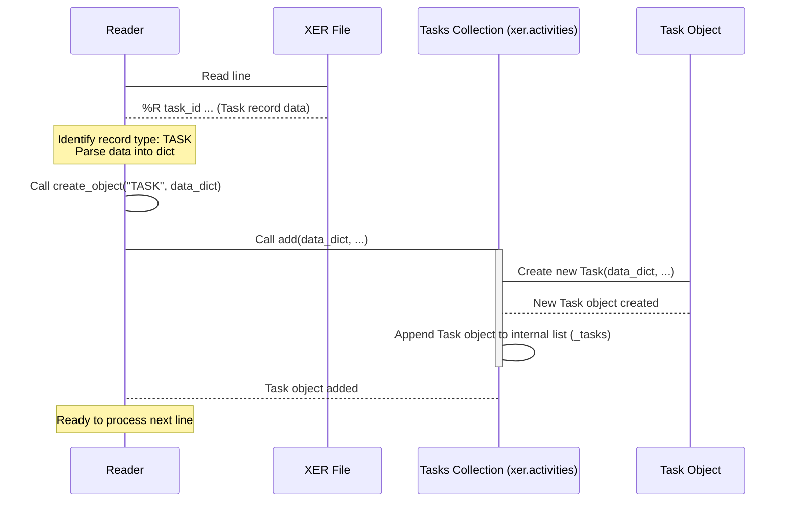

# Chapter 2: Data Collections

Welcome back! In [Chapter 1: Reader](01_reader_.md), we learned how the `Reader` is your first step in using Alt-Ctrl-Proj. It takes your complex XER file and loads all that project data into memory.

But where does all that data go? The XER file contains many different types of information: projects, tasks (activities), WBS elements, resources, relationships, and lots more! If the `Reader` just dumped *everything* into one big, messy list, it would be incredibly hard to find what you need.

This is where **Data Collections** come in.

## Why Do We Need Data Collections?

Imagine the XER file as a giant filing cabinet with many different drawers. One drawer has all the information about **Tasks**, another about **Resources**, another about **Relationships**, and so on.

When the `Reader` opens the filing cabinet, it doesn't just pile all the documents onto one table. Instead, it takes all the **Task** documents and puts them neatly into a dedicated "Tasks" box. All the **Resource** documents go into a "Resources" box, and so on.

In Alt-Ctrl-Proj, these "boxes" are the **Data Collections**. They are specialized containers designed to hold all the objects of a specific type found in your XER file.

The main benefit? **Organization and easy access.** Instead of searching through a jumbled mess, you know exactly where to look for tasks, where to look for resources, etc. Plus, these collections often come with helpful tools (methods) built right in, specifically for working with the data they hold.

## What are Data Collections in Alt-Ctrl-Proj?

After `xer = Reader("my_project.xer")` finishes loading, the `xer` object (your instance of the `Reader`) becomes a central hub. It holds references to various Data Collection objects.

Each collection holds objects of a particular type that were parsed from the XER file:

* `xer.projects`: Holds `Project` objects.
* `xer.activities`: Holds `Task` objects (tasks are called 'Activities' in P6, hence the attribute name).
* `xer.wbss`: Holds `WBS` objects.
* `xer.relations`: Holds `TaskPred` objects (Relationships between tasks).
* `xer.resources`: Holds `Resource` objects.
* And many more for other data types...

Think of `xer.activities` not just as a simple list of tasks, but as a smart container specifically built to manage a group of `Task` objects.

## Accessing and Using Collections

Let's revisit our example from Chapter 1 and see how we interact with these collections.

First, load the file:

```python
from xer_parser.reader import Reader

# Load your XER file
try:
    xer = Reader("my_project.xer")
    print("File loaded successfully!")
except FileNotFoundError:
    print("Error: my_project.xer not found.")
    exit() # Stop if the file isn't found
except Exception as e:
    print(f"An error occurred: {e}")
    exit()
```

Now, let's access the collection of activities:

```python
# Access the activities collection
all_activities = xer.activities

# Check how many activities are in the collection
print(f"Total activities found: {all_activities.count}")
```

The `.count` property (or method, depending on the collection) is a simple example of a useful feature provided by the collection object. It tells you exactly how many items of that type were loaded.

### Iterating Through a Collection

Collections are **iterable**, which means you can easily loop through all the items they contain using a standard Python `for` loop. This is the correct and primary way to access individual items when you want to process all of them.

```python
print("\nListing the first 5 activities:")
# Loop through the activities collection
for i, activity in enumerate(xer.activities):
    if i >= 5: # Stop after the first 5 for this example
        break
    # 'activity' is a single Task object!
    print(f"{i+1}. Code: {activity.task_code}, Name: {activity.task_name}")

```

This loop is much cleaner than trying to access some internal list directly, as we briefly did in Chapter 1 just to show *something* happening. The collection object manages the iteration for you. When you say `for activity in xer.activities:`, the `xer.activities` collection object gives you one `Task` object at a time until it runs out.

### Finding Specific Items

One of the most useful features of these collections is the ability to quickly find a specific item. Collections often have methods like `find_by_id` or `find_by_code`.

Let's say you know the unique ID of a task in Primavera P6 (this is the internal database ID, often different from the Activity ID/Code you see). You can find it directly:

```python
# Assuming you know a task_id, e.g., from the XER file raw data
task_id_to_find = 12345 # Replace with an actual ID from your file

# Use the find_by_id method
specific_task = xer.activities.find_by_id(task_id_to_find)

if specific_task:
    print(f"\nFound task with ID {task_id_to_find}:")
    print(f"  Code: {specific_task.task_code}")
    print(f"  Name: {specific_task.task_name}")
else:
    print(f"\nTask with ID {task_id_to_find} not found.")

```

Similarly, for tasks, you can often find them using their visible code:

```python
# Assuming you know a task code, e.g., "A1010"
task_code_to_find = "A1010" # Replace with an actual Code from your file

# Use the find_by_code method (available on Tasks collection)
specific_task_by_code = xer.activities.find_by_code(task_code_to_find)

if specific_task_by_code:
    print(f"\nFound task with Code {task_code_to_find}:")
    print(f"  ID: {specific_task_by_code.task_id}")
    print(f"  Name: {specific_task_by_code.task_name}")
else:
    print(f"\nTask with Code {task_code_to_find} not found.")

```

These methods are much more convenient than manually looping through the collection and checking the ID or code of each item yourself.

## Under the Hood: How Collections Work

Let's peek behind the curtain slightly to see what makes these collections tick.

Recall from [Chapter 1: Reader](01_reader_.md) that the `Reader` processes the XER file line by line. When it finds a `%R` row, it identifies the `current_table` (like `TASK`, `RSRC`, `TASKPRED`) and calls its internal `create_object` method.

```python
# Inside the Reader class __init__ method (simplified)
# ... reading lines and getting zipped_record ...
    elif row[0] == "%R":
        zipped_record = dict(zip(current_headers, row[1:], strict=False))
        # The Reader knows the table type and calls this:
        self.create_object(current_table, zipped_record)
# ...
```

The `create_object` method then looks at the `object_type` (the table name) and decides which collection object to add the newly created item to.

```python
# Inside the Reader class create_object method (simplified)
# ...
    if object_type.strip() == "PROJECT":
        self._projects.add(params, self._data) # Add to the Projects collection
    elif object_type.strip() == "TASK":
        self._tasks.add(params, self._data)     # Add to the Tasks collection
    elif object_type.strip() == "RSRC":
        self._resources.add(params)         # Add to the Resources collection
    # ... and so on for other types
```

So, a collection object like `_tasks` (which is an instance of the `Tasks` class) exists *within* the `Reader` object. It's initialized as an empty container:

```python
# Inside xer_parser/model/tasks.py, in the Tasks class __init__
class Tasks:
    def __init__(self):
        self.index = 0 # Used for iteration
        self._tasks = [] # This is where the Task objects are stored!

    # ... methods like add, find_by_id, count, etc. ...
```

When `self._tasks.add(params, self._data)` is called by the `Reader`, the `Tasks` collection's `add` method takes the raw data (`params`), creates a `Task` object from it, and appends it to its internal list (`self._tasks`):

```python
# Inside xer_parser/model/tasks.py, in the Tasks class add method
    def add(self, params, data):
        task = Task(params, data) # Create the Task object
        self._tasks.append(task)   # Add it to the internal list
```

All the useful methods we saw earlier (`find_by_id`, `count`, etc.) simply operate on this internal list (`self._tasks`). For example, `count` is just `len(self._tasks)`. `find_by_id` loops through `self._tasks` to find the item with the matching ID. The iteration (`for task in xer.activities:`) works because the `Tasks` class (and other collection classes) implements Python's iterator protocol (`__iter__` and `__next__` methods).

Here's a very simplified sequence showing how a Task record is processed:



This shows that the `Reader` delegates the creation and storage of specific object types to their corresponding collection objects.

## Summary of Key Collections on the Reader

Once you have your `Reader` object, here are the main collections you'll likely interact with right away, each accessible as an attribute of the `xer` object:

| Attribute          | Collection Class           | Holds Objects Of Type | Description                                        | Chapter Focus      |
| :----------------- | :------------------------- | :-------------------- | :------------------------------------------------- | :----------------- |
| `xer.projects`     | `Projects`                 | `Project`             | Information about the project(s).                  | [Chapter 3](03_project_.md) |
| `xer.activities`   | `Tasks`                    | `Task`                | All project tasks/activities.                      | [Chapter 4](04_task__activity__.md) |
| `xer.wbss`         | `WBSs`                     | `WBS`                 | Work Breakdown Structure elements.                 | [Chapter 5](05_wbs__work_breakdown_structure__.md) |
| `xer.relations`    | `Predecessors`             | `TaskPred`            | Relationships (dependencies) between tasks.        | [Chapter 6](06_relationship__taskpred__.md) |
| `xer.resources`    | `Resources`                | `Resource`            | Resources used in the project.                     | [Chapter 7](07_resource_.md) |
| `xer.calendars`    | `Calendars`                | `Calendar`            | Project calendars.                                 | (Not a dedicated chapter, but used by Tasks) |
| `xer.activitycodes` | `ActivityCodes` / `TaskActvs` | `ActivityCode` / `TaskActv` | Activity codes and their assignments to tasks. | (Used in [DCMA14](08_dcma14_analysis_.md) and other analyses) |
| ... and others     | ...                        | ...                   | Other Primavera P6 data like OBS, UDFs, etc.     |                    |

Each of these collection objects provides methods relevant to the type of data it contains. You'll explore the most important ones (`Projects`, `Tasks`, `WBSs`, `Relations`, `Resources`) in detail in the upcoming chapters.

## Conclusion

In this chapter, you've learned that after the `Reader` processes an XER file, it doesn't just give you raw data. Instead, it intelligently organizes the parsed Primavera P6 entities into specific **Data Collection** objects, like `xer.activities` for tasks or `xer.resources` for resources.

These collections are powerful containers. They allow you to easily:

1. Access groups of related items (all tasks, all resources).
2. Iterate through all items in the collection using simple `for` loops.
3. Use helpful methods like `count` or `find_by_id` to work with the items more efficiently.

Understanding Data Collections is key to navigating the information loaded from your XER file. You now know how to access these collections from the `Reader` object and perform basic operations like counting or iterating.

In the next chapter, we'll start diving into the details of the first major collection type: the `Projects` collection, and what you can do with the `Project` objects it contains.

Let's move on to [Chapter 3: Project](03_project_.md).

---

<sub><sup>Generated by [AI Codebase Knowledge Builder](https://github.com/The-Pocket/Tutorial-Codebase-Knowledge).</sup></sub> <sub><sup>**References**: [[1]](https://github.com/osama-ata/Alt-Ctrl-Proj/blob/61f38213dc38bccd4d84cb765b1a5678723c47c2/xer_parser/model/classes/data.py), [[2]](https://github.com/osama-ata/Alt-Ctrl-Proj/blob/61f38213dc38bccd4d84cb765b1a5678723c47c2/xer_parser/model/predecessors.py), [[3]](https://github.com/osama-ata/Alt-Ctrl-Proj/blob/61f38213dc38bccd4d84cb765b1a5678723c47c2/xer_parser/model/projects.py), [[4]](https://github.com/osama-ata/Alt-Ctrl-Proj/blob/61f38213dc38bccd4d84cb765b1a5678723c47c2/xer_parser/model/resources.py), [[5]](https://github.com/osama-ata/Alt-Ctrl-Proj/blob/61f38213dc38bccd4d84cb765b1a5678723c47c2/xer_parser/model/tasks.py), [[6]](https://github.com/osama-ata/Alt-Ctrl-Proj/blob/61f38213dc38bccd4d84cb765b1a5678723c47c2/xer_parser/model/wbss.py), [[7]](https://github.com/osama-ata/Alt-Ctrl-Proj/blob/61f38213dc38bccd4d84cb765b1a5678723c47c2/xer_parser/reader.py)</sup></sub>
