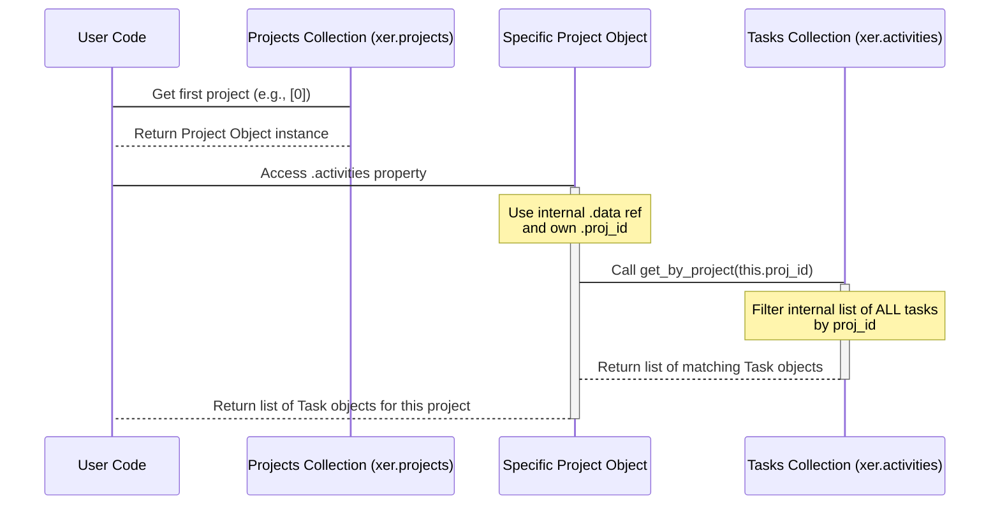

# Chapter 3: Project

Welcome back! In [Chapter 1: Reader](01_reader_.md), you learned how to load your XER file using the `Reader`, and in [Chapter 2: Data Collections](02_data_collections_.md), you saw how the `Reader` organizes all the data into different collections (like `xer.activities` or `xer.wbss`).

Now, it's time to dive into one of the most fundamental pieces of data from your XER file: the **Project** itself.

## What is a Project Object?

Think of a Primavera P6 XER file like a big folder that might contain one or more projects. Inside that folder, everything related to a specific project is organized: the list of tasks for that project, the Work Breakdown Structure (WBS) for that project, details about the project's start and finish dates, etc.

In PyP6Xer-dev, the `Project` object is the Python representation of one of these project containers from your XER file. It's like a single, organized sub-folder within the main XER data that holds all the top-level information about that specific project.

The `Project` object holds:

1.  **Details *about* the project:** Things like its name, ID, planned dates, and various settings.
2.  **Access points *to* the data within that project:** Importantly, it lets you easily find the specific tasks and WBS elements that belong to *this* project, pulling them from the main collections loaded by the `Reader`.

## Accessing Project Objects

As you learned in [Chapter 2: Data Collections](02_data_collections_.md), the `Reader` object provides access to a collection of projects via the `.projects` attribute:

```python
from xerparser_dev.reader import Reader

# Load your XER file (replace 'my_project.xer' with your file)
try:
    xer = Reader("my_project.xer")
    print("File loaded successfully!")
except FileNotFoundError:
    print("Error: my_project.xer not found.")
    exit()
except Exception as e:
    print(f"An error occurred: {e}")
    exit()

# Access the collection of projects
project_collection = xer.projects

print(f"\nFound {len(project_collection._projects)} project(s) in the file.") # Using internal list count for clarity
```

The `xer.projects` attribute is an instance of the `Projects` collection class, designed specifically to manage `Project` objects.

While an XER file *can* contain multiple projects (especially exports of baselines or multiple projects at once), it's very common for an XER file to represent a single active project. In that case, the main project will often be the first one in the collection.

You can access individual `Project` objects from the `projects` collection using iteration (like we did for activities in Chapter 2) or by using the `find_by_id` method if you know the project's unique database ID:

```python
# Accessing the first project (common case for single-project XERs)
if xer.projects:
    main_project = xer.projects[0] # Get the first Project object
    print("\nAccessed the first project.")
else:
    print("\nNo projects found to access.")
    main_project = None # Ensure main_project is None if no projects

# You could also loop if there were multiple projects:
# print("\nListing all projects:")
# for project in xer.projects:
#    print(f"- {project.proj_short_name} (ID: {project.proj_id})")
```

Now that you have a `Project` object (e.g., stored in the `main_project` variable), you can start exploring the information it holds.

## Accessing Project Details

A `Project` object has many attributes that correspond to the data fields stored for that project in the XER file's `PROJECT` table. These attributes give you information *about* the project itself.

Some common and useful attributes include:

*   `proj_id`: The unique internal ID of the project.
*   `proj_short_name`: The name of the project as seen in P6.
*   `plan_start_date`: The project's planned start date.
*   `plan_end_date`: The project's planned end date.
*   `last_recalc_date`: The date the schedule was last calculated.
*   `critical_path_type`: How the critical path is determined (e.g., Total Float <= 0).
*   ...and many more!

You access these just like any other object attribute in Python:

```python
if main_project:
    # Accessing attributes of the Project object
    print("\nProject Details:")
    print(f"  ID: {main_project.proj_id}")
    print(f"  Name: {main_project.proj_short_name}")
    print(f"  Planned Start: {main_project.plan_start_date}")
    print(f"  Planned End: {main_project.plan_end_date}")
    print(f"  Last Calculated: {main_project.last_recalc_date}")
    print(f"  Critical Path Method: {main_project.critical_path_type}")
```

This code snippet gets the first `Project` object and prints some of its core details. The exact attributes available can be found in the `Project` class definition in the library's code (specifically, `xerparser_dev/model/classes/project.py`).

## Accessing Contained Elements (Activities and WBS)

One of the most powerful features of the `Project` object is that it provides convenient access to the tasks and WBS elements that belong *specifically* to that project.

Recall that the `Reader` loads *all* tasks into the main `xer.activities` collection and *all* WBS elements into the main `xer.wbss` collection. When you have multiple projects in one XER file, these main collections contain items from *all* projects.

The `Project` object acts as a filter for these main collections. It has properties that give you *only* the tasks or WBS elements associated with *its* specific `proj_id`.

*   `project.activities`: Provides a list of `Task` objects that belong to this project.
*   `project.wbss`: Provides a list of `WBS` objects that belong to this project.

Let's see how to use these:

```python
if main_project:
    # Access tasks belonging to this specific project
    project_activities = main_project.activities
    print(f"\nActivities in '{main_project.proj_short_name}':")
    print(f"  Found {len(project_activities)} tasks belonging to this project.")

    # Access WBS elements belonging to this specific project
    project_wbss = main_project.wbss
    print(f"WBS Elements in '{main_project.proj_short_name}':")
    print(f"  Found {len(project_wbss)} WBS elements belonging to this project.")

    # You can iterate through these lists just like any other list
    print("\nFirst 5 WBS elements for this project:")
    for i, wbs in enumerate(project_wbss):
        if i >= 5: break
        # 'wbs' is a WBS object (more on these in Chapter 5!)
        print(f"- {wbs.wbs_name}")

    print("\nFirst 5 tasks for this project:")
    for i, task in enumerate(project_activities):
        if i >= 5: break
        # 'task' is a Task object (more on these in Chapter 4!)
        print(f"- {task.task_code} - {task.task_name}")
```

This code demonstrates how the `project.activities` and `project.wbss` attributes provide a view into the relevant data for just that project, even though the raw data for all projects' tasks and WBS is stored centrally in the main `xer` object's collections.

## Under the Hood: How the Project Object Works

Let's look at what happens internally when you access something like `project.activities`.

As we saw in [Chapter 1: Reader](01_reader_.md), the `Reader` reads the `%T PROJECT` line, then the `%F` headers, and then for each `%R` line in the `PROJECT` section, it creates a `Project` object using its `create_object` method.

```python
# Inside Reader.create_object (simplified)
# ...
elif object_type.strip() == "PROJECT":
    # Creates Project object and passes the raw data (params)
    # and a reference to the main data container (self._data)
    self._projects.add(params, self._data)
# ...
```

The `Project` object's `__init__` method (`xerparser_dev/model/classes/project.py`) receives the `params` (a dictionary of the raw data for this project) and importantly, a reference to `self._data`. The `self._data` object is a helper object (`xerparser_dev/model/classes/data.py`) that holds references to *all* the main collections (`_projects`, `_tasks`, `_wbss`, etc.).

```python
# Inside Project.__init__ (simplified)
class Project:
    def __init__(self, params: dict[str, Any], data: Any) -> None:
        # Store raw data attributes like proj_id, proj_short_name, etc.
        self.proj_id = int(params.get("proj_id").strip()) if params.get("proj_id") else None
        self.proj_short_name = params.get("proj_short_name").strip() if params.get("proj_short_name") else None
        # ... store other attributes ...

        # Store the reference to the main data container
        self.data = data

    # ... other methods and properties ...
```

When you call `project.activities`, you are accessing a `@property` defined in the `Project` class:

```python
# Inside Project class (xerparser_dev/model/classes/project.py)
    @property
    def activities(self) -> list[Any]:
        """
        Get all activities in this project.
        """
        # Use the stored reference to the main data container (self.data)
        # Access the main tasks collection (self.data.tasks)
        # Call the get_by_project method on the tasks collection,
        # passing THIS project's ID (self.proj_id)
        return self.data.tasks.get_by_project(self.proj_id)

    @property
    def wbss(self) -> list[WBS]:
        """
        Get all WBS elements in this project.
        """
        # Similar logic for WBS
        return self.data.wbss.get_by_project(self.proj_id)

    # ...
```

So, the `Project` object itself doesn't *contain* lists of tasks or WBS. Instead, it knows its own ID and holds a pointer back to the main central collections. When you ask for its activities (`project.activities`), it tells the main `Tasks` collection, "Hey, give me all the tasks whose `proj_id` matches my `proj_id`!". The `Tasks` collection then filters its complete list and returns the relevant tasks.

This approach keeps the `Project` objects lightweight and avoids duplicating large lists of tasks or WBS elements if you were to access them directly.

Here's a simplified sequence diagram showing how `project.activities` works:



This diagram illustrates that the work of finding the tasks belonging to the project is done by the central `Tasks` collection, orchestrated by the `Project` object using its ID.

## Key Attributes of the Project Object

Here's a quick look at some of the commonly used attributes available on a `Project` object:

| Attribute             | Type     | Description                                      |
| :-------------------- | :------- | :----------------------------------------------- |
| `proj_id`             | `int`    | Unique internal project ID.                      |
| `proj_short_name`     | `str`    | Project name.                                    |
| `plan_start_date`     | `str`    | Planned start date string.                       |
| `plan_end_date`       | `str`    | Planned end date string.                         |
| `last_recalc_date`    | `str`    | Date of the last schedule calculation string.    |
| `critical_path_type`  | `str`    | Method used for critical path (e.g., `CT_TF0`).  |
| `activities`          | `list`   | List of `Task` objects belonging to this project.|
| `wbss`                | `list`   | List of `WBS` objects belonging to this project. |

Note that date attributes like `plan_start_date` are typically stored as strings in the raw XER data. You might need to convert them to Python `datetime` objects if you plan to perform date calculations (PyP6Xer-dev doesn't do this automatically for all date fields).

## Conclusion

In this chapter, you've learned that the `Project` object in PyP6Xer-dev represents a single project from your XER file. It's more than just a collection of attributes; it acts as a central point to access information *about* the project and provides convenient ways to retrieve the tasks and WBS elements that belong specifically to it, by filtering the main collections managed by the `Reader`.

You now know how to access the `Project` collection from the `Reader`, get individual `Project` objects, and use their attributes and the `.activities` and `.wbss` properties to explore the project's structure and contents.

Understanding the `Project` object is crucial because it's the top-level container for everything else in your schedule data. The next logical step is to look inside the project and examine the individual work items that make it up.

Let's move on to [Chapter 4: Task (Activity)](04_task__activity__.md) to learn all about the task or activity objects within your project.

---

<sub><sup>Generated by [AI Codebase Knowledge Builder](https://github.com/The-Pocket/Tutorial-Codebase-Knowledge).</sup></sub> <sub><sup>**References**: [[1]](https://github.com/osama-ata/PyP6Xer-dev/blob/61f38213dc38bccd4d84cb765b1a5678723c47c2/docs/source/examples.rst), [[2]](https://github.com/osama-ata/PyP6Xer-dev/blob/61f38213dc38bccd4d84cb765b1a5678723c47c2/docs/source/getting_started.rst), [[3]](https://github.com/osama-ata/PyP6Xer-dev/blob/61f38213dc38bccd4d84cb765b1a5678723c47c2/xerparser_dev/model/classes/project.py), [[4]](https://github.com/osama-ata/PyP6Xer-dev/blob/61f38213dc38bccd4d84cb765b1a5678723c47c2/xerparser_dev/model/projects.py), [[5]](https://github.com/osama-ata/PyP6Xer-dev/blob/61f38213dc38bccd4d84cb765b1a5678723c47c2/xerparser_dev/reader.py)</sup></sub>
