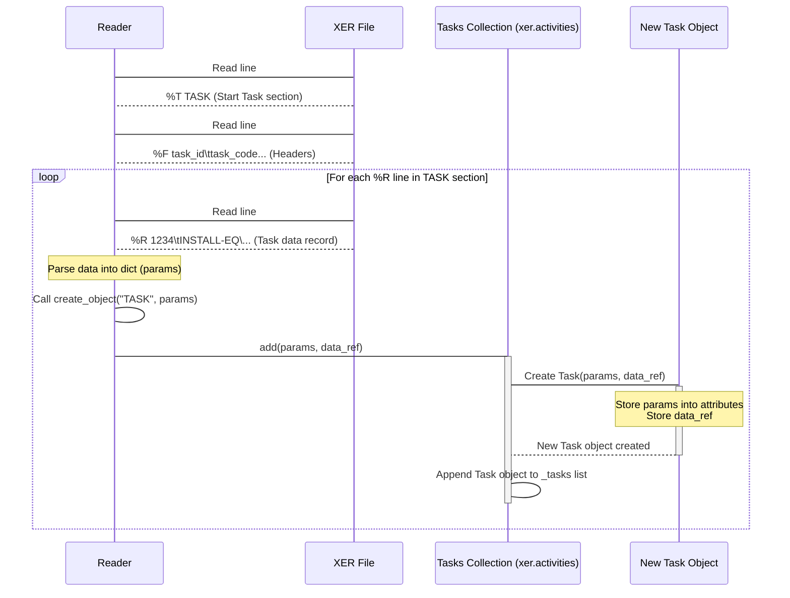

# Chapter 4: Task (Activity)

Welcome back! In our journey through Alt-Ctrl-Proj, we've learned how the [Reader](01_reader_.md) loads your XER file, how it organizes all the data into [Data Collections](02_data_collections_.md), and how the top-level container for a project's data is the [Project](03_project_.md) object.

Now, it's time to look at the core building blocks *inside* a project: the individual work items you need to complete. These are called **Tasks** (or **Activities** in Primavera P6 terminology).

## What is a Task (Activity) Object?

Imagine your project schedule is a detailed to-do list. Each item on that list is a task or activity: "Pour Foundation," "Install Electrical Wiring," "Test System," etc. These are the specific pieces of work that need to be done.

In Alt-Ctrl-Proj, a `Task` object is the Python representation of one of these single activity records from your XER file. When the `Reader` processes the `TASK` section of the XER file, it creates a `Task` object for every activity it finds.

Each `Task` object is like a digital index card for that specific activity. It holds *all* the details about that activity, such as:

* Its unique ID and code (like "A1000").
* Its name ("Excavate Site").
* Its planned, early, and late start and finish dates.
* How long it's supposed to take (its duration).
* Its current status (Not Started, In Progress, Complete).
* Which calendar it uses.
* Which Work Breakdown Structure ([WBS](05_wbs__work_breakdown_structure__.md)) element it belongs to.
* Information linking it to its [Predecessors and Successors](06_relationship__taskpred__.md) (the tasks that come before or after it).
* Which [Resources](07_resource_.md) are assigned to it.

Being able to access and understand `Task` objects is fundamental because they contain most of the critical scheduling information you'll want to analyze or report on.

## Accessing Task Objects

Just like projects and other data types, tasks are organized into a **Data Collection** by the `Reader`. You access the collection of all tasks found in the XER file through the `xer.activities` attribute.

Let's start by loading our file and accessing this collection:

```python
from xerparser_dev.reader import Reader

# Load your XER file
try:
    xer = Reader("my_project.xer")
    print("File loaded successfully!")
except FileNotFoundError:
    print("Error: my_project.xer not found.")
    exit() # Stop if the file isn't found
except Exception as e:
    print(f"An error occurred: {e}")
    exit()

# Access the collection of all activities/tasks
all_activities = xer.activities

# The activities collection is like a list of Task objects
print(f"\nFound {all_activities.count} total activities in the file.")
```

Remember from [Chapter 2: Data Collections](02_data_collections_.md) that `xer.activities` is an instance of a special collection class (`Tasks`), designed to hold and manage `Task` objects. It's iterable, meaning you can loop through it, and it has helpful methods like `find_by_id` and `find_by_code`.

## Listing Your First Tasks

A common task is simply listing the activities in the schedule to get an overview. We can do this by iterating through the `xer.activities` collection.

Let's print the code and name for the first few tasks:

```python
# Print details for the first few activities
print("\nFirst 5 activities (tasks):")

# Iterate directly over the collection
for i, activity in enumerate(xer.activities):
    if i >= 5: # Stop after the first 5 for this example
        break
    # 'activity' is a single Task object
    print(f"{i+1}. Code: {activity.task_code}, Name: {activity.task_name}")
```

**What this code does:**

1. `for i, activity in enumerate(xer.activities):`: This loop iterates through the `xer.activities` collection. In each loop, `activity` becomes the next `Task` object from the collection. `enumerate` is used just to get a counter `i`.
2. `if i >= 5: break`: We limit the output to the first 5 tasks to keep the example short.
3. `print(...)`: Inside the loop, we access attributes of the current `Task` object: `activity.task_code` and `activity.task_name`.

This simple iteration is your primary way to process tasks when you need to look at all or many of them.

## Finding a Specific Task

Often, you'll want to find a specific task, either by its unique internal ID or by its visible Activity Code. The `xer.activities` collection provides methods for this.

Let's try finding a task using its code:

```python
# Assuming you know an activity code, e.g., "INSTALL-EQ"
task_code_to_find = "INSTALL-EQ" # Replace with a real code from your file

# Use the find_by_code method on the activities collection
specific_task_by_code = xer.activities.find_by_code(task_code_to_find)

if specific_task_by_code:
    print(f"\nFound task with Code '{task_code_to_find}':")
    print(f"  ID: {specific_task_by_code.task_id}")
    print(f"  Name: {specific_task_by_code.task_name}")
    print(f"  Status: {specific_task_by_code.status_code}")
else:
    print(f"\nTask with Code '{task_code_to_find}' not found.")
```

And you can also find it using its internal database ID:

```python
# Assuming you know a task ID, e.g., 12345
task_id_to_find = 12345 # Replace with a real ID from your file

# Use the find_by_id method on the activities collection
specific_task_by_id = xer.activities.find_by_id(task_id_to_find)

if specific_task_by_id:
     print(f"\nFound task with ID {task_id_to_find}:")
     print(f"  Code: {specific_task_by_id.task_code}")
     print(f"  Name: {specific_task_by_id.task_name}")
else:
     print(f"\nTask with ID {task_id_to_find} not found.")
```

These `find_by_...` methods are very efficient ways to retrieve a single `Task` object when you know its identifier, saving you from manually looping through all activities.

## Exploring Task Details (Attributes)

Once you have a `Task` object (either by iterating or finding it), you can access its various attributes to get detailed information. These attributes directly correspond to the columns in the `TASK` table of the XER file.

Here are some examples of common and useful attributes you can access:

```python
# Assuming 'specific_task_by_code' holds a Task object from the previous example
if specific_task_by_code:
    task = specific_task_by_code # Make it easier to reference

    print(f"\nDetailed information for task '{task.task_code}':")
    print(f"  Task Name: {task.task_name}")
    print(f"  Database ID: {task.task_id}")
    print(f"  Project ID: {task.proj_id}") # ID of the project it belongs to
    print(f"  WBS ID: {task.wbs_id}")     # ID of the WBS element it belongs to
    print(f"  Calendar ID: {task.clndr_id}") # ID of the assigned calendar
    print(f"  Type: {task.task_type}")      # e.g., 'Task Dependent', 'Finish Milestone'
    print(f"  Status: {task.status_code}") # e.g., 'TK_NotStart', 'TK_Active', 'TK_Complete'

    # Date attributes (often datetime objects after parsing)
    print(f"  Early Start: {task.early_start_date}")
    print(f"  Early Finish: {task.early_end_date}")
    print(f"  Actual Start: {task.act_start_date}")
    print(f"  Actual Finish: {task.act_end_date}")
    print(f"  Planned Start: {task.target_start_date}")
    print(f"  Planned Finish: {task.target_end_date}")

    # Duration and Float
    # Note: raw duration is in hours (target_drtn_hr_cnt).
    # The .duration property calculates it in days using the calendar.
    print(f"  Raw Duration (hours): {task.target_drtn_hr_cnt}")
    print(f"  Calculated Duration (days): {task.duration}")
    print(f"  Total Float (hours): {task.total_float_hr_cnt}")

    # Accessing related collections (briefly)
    # Note: These properties often filter the main xer collections
    # More details in later chapters!
    # print(f"  Number of predecessors: {len(task.predecessors)}") # From Chapter 6
    # print(f"  Number of successors: {len(task.successors)}")   # From Chapter 6
    # print(f"  Number of resource assignments: {len(task.resources)}") # From Chapter 7
    # print(f"  Assigned Calendar: {task.calendar.clndr_name if task.calendar else 'N/A'}") # Linked via clndr_id

```

**Explanation:**

* Each attribute (`task.task_name`, `task.early_start_date`, etc.) gives you a specific piece of data about that task.
* Attributes like `task_id`, `proj_id`, `wbs_id`, `clndr_id`, `task_code`, `task_name`, `task_type`, `status_code` come directly from the raw data fields.
* Date attributes (like `early_start_date`, `act_start_date`) are often automatically parsed into Python `datetime` objects by the library, making date calculations easier than working with raw strings.
* `target_drtn_hr_cnt` is the duration in hours as stored in the XER. The `.duration` property is a helpful calculated value that attempts to convert this to days using the task's assigned calendar's daily hours.
* Attributes like `predecessors`, `successors`, and `resources` are often properties that, when accessed, use the task's ID to find related objects in other collections managed by the `Reader` (like `xer.relations` or `xer.activityresources`). We'll explore these links more in later chapters.

By accessing these attributes, you can retrieve and inspect all the detailed information about any task in your schedule.

## Under the Hood: How Task Objects are Created

Let's revisit how the `Reader` creates these `Task` objects, building on what we learned in [Chapter 1: Reader](01_reader_.md) and [Chapter 2: Data Collections](02_data_collections_.md).

1. The `Reader` is processing the XER file line by line.
2. It finds a line starting with `%T TASK`. It notes that the following records are tasks.
3. It finds the `%F` line for `TASK` and reads the header names (like `task_id`, `task_code`, `task_name`, `early_start_date`, etc.).
4. For every line starting with `%R` that follows (until the next `%T`):
    * The `Reader` parses the data from that `%R` line into a dictionary, mapping header names to values (`params`).
    * It identifies the record type as "TASK".
    * It calls its internal `create_object` method, passing the type ("TASK") and the data dictionary (`params`).

```python
# Inside Reader.create_object (simplified)
# ...
elif object_type.strip() == "TASK":
    # The Reader gets the raw data (params) for one task.
    # It calls the 'add' method on the Tasks collection (_tasks).
    # It also passes a reference to the main data container (self._data).
    self._tasks.add(params, self._data)
# ...
```

The `self._tasks` attribute is an instance of the `Tasks` collection class (`xerparser_dev/model/tasks.py`). Its `add` method is responsible for creating the actual `Task` object:

```python
# Inside xerparser_dev/model/tasks.py, in the Tasks class add method
    def add(self, params, data):
        # Create the Task object using the raw data (params)
        # and the reference to the main data container (data)
        task = Task(params, data)
        # Add the newly created Task object to the collection's internal list
        self._tasks.append(task)
```

Finally, let's look inside the `Task` class itself (`xerparser_dev/model/classes/task.py`). The `__init__` method receives the `params` dictionary and the `data` reference:

```python
# Inside xerparser_dev/model/classes/task.py, in the Task class __init__
class Task:
    def __init__(self, params: dict[str, Any], data: Any) -> None:
        # Store attributes directly from the params dictionary,
        # often converting data types (like int for IDs, datetime for dates)
        self.task_id = int(params.get("task_id")) if params.get("task_id") else None
        self.proj_id = int(params.get("proj_id")) if params.get("proj_id") else None
        self.task_code = params.get("task_code").strip() if params.get("task_code") else None
        self.task_name = params.get("task_name").strip() if params.get("task_name") else None
        # Example of date parsing:
        self.early_start_date = (
            datetime.strptime(params.get("early_start_date"), "%Y-%m-%d %H:%M")
            if params.get("early_start_date")
            else None
        )
        # ... store many other attributes ...

        # Store the reference to the main data container
        self.data = data

    # ... properties like .duration, .predecessors, etc. ...
```

This `__init__` method populates the `Task` object's attributes with the specific data from that task's `%R` record. The `data` reference is stored so that properties like `task.predecessors` can access the main `xer.relations` collection (via `self.data.predecessors`) and find the relevant relationships for this task using its `task_id`.

Here's a simplified sequence diagram showing the creation of a single Task object:



This shows how the `Reader` orchestrates the process, delegating the creation of the specific `Task` object to the `Tasks` collection, which then instantiates the `Task` class and holds onto it.

## Key Attributes of the Task Object

Here's a table summarizing some of the most commonly used attributes and properties on a `Task` object:

| Attribute / Property        | Type           | Description                                                                 |
| :-------------------------- | :------------- | :-------------------------------------------------------------------------- |
| `task_id`                   | `int`          | Unique internal database ID of the task.                                    |
| `task_code`                 | `str`          | The visible Activity ID/Code (e.g., "A1010").                               |
| `task_name`                 | `str`          | The name of the task.                                                       |
| `proj_id`                   | `int`          | ID of the project this task belongs to.                                     |
| `wbs_id`                    | `int`          | ID of the WBS element this task belongs to.                                 |
| `clndr_id`                  | `int`          | ID of the calendar assigned to the task.                                    |
| `task_type`                 | `str`          | Type of task (e.g., `TT_Task` (Task Dependent), `TT_Milestone` (Start/Finish)). |
| `status_code`               | `str`          | Current status (e.g., `TK_NotStart`, `TK_Active`, `TK_Complete`).           |
| `early_start_date`          | `datetime`     | Earliest possible start date (calculated by scheduler).                       |
| `early_end_date`            | `datetime`     | Earliest possible finish date (calculated by scheduler).                      |
| `late_start_date`           | `datetime`     | Latest possible start date without delaying project (calculated by scheduler). |
| `late_end_date`             | `datetime`     | Latest possible finish date without delaying project (calculated by scheduler). |
| `act_start_date`            | `datetime`     | Actual start date if started.                                               |
| `act_end_date`              | `datetime`     | Actual finish date if completed.                                            |
| `target_start_date`         | `datetime`     | Planned start date (from baseline or initial plan).                         |
| `target_end_date`           | `datetime`     | Planned finish date (from baseline or initial plan).                        |
| `target_drtn_hr_cnt`        | `float`        | Original/Planned duration in *hours* (raw data field).                     |
| `duration`                  | `float`        | Calculated duration in *days* (property, considers calendar).              |
| `total_float_hr_cnt`        | `float`        | Total float in *hours*.                                                     |
| `free_float_hr_cnt`         | `float`        | Free float in *hours*.                                                      |
| `remain_drtn_hr_cnt`        | `float`        | Remaining duration in *hours*.                                              |
| `cstr_type`                 | `str`          | Type of primary constraint (e.g., `CS_MANDFIN`, `CS_STARTON`).              |
| `cstr_date`                 | `datetime`     | Date associated with the primary constraint.                                |
| `predecessors`              | `list` (`TaskPred`) | List of relationship objects where this task is the successor.              |
| `successors`                | `list` (`TaskPred`) | List of relationship objects where this task is the predecessor.            |
| `resources`                 | `list` (`TaskRsrc`) | List of resource assignment objects for this task.                          |
| `calendar`                  | `Calendar`     | The Calendar object assigned to this task (accessed via `clndr_id`).        |

This is not an exhaustive list, but covers many of the essential attributes you'll use regularly.

## Conclusion

In this chapter, you've learned that `Task` objects (Activities) are the fundamental work items in a Primavera P6 schedule and in Alt-Ctrl-Proj. You now know how to:

* Access the collection of all tasks using `xer.activities`.
* Iterate through the tasks collection to process multiple activities.
* Find a specific task by its ID or Code using `find_by_id` and `find_by_code`.
* Access the various attributes of a `Task` object to retrieve detailed information like names, codes, dates, duration, and status.
* Understand how the `Reader` and the `Tasks` collection work together to create and store these objects.

You now have the ability to examine the individual pieces of work that make up your project. The next logical step is to understand how these tasks are organized hierarchically within the project.

Let's move on to [Chapter 5: WBS (Work Breakdown Structure)](05_wbs__work_breakdown_structure__.md) to see how `Task` objects relate to the Work Breakdown Structure.

---

<sub><sup>Generated by [AI Codebase Knowledge Builder](https://github.com/The-Pocket/Tutorial-Codebase-Knowledge).</sup></sub> <sub><sup>**References**: [[1]](https://github.com/osama-ata/Alt-Ctrl-Proj/blob/61f38213dc38bccd4d84cb765b1a5678723c47c2/docs/source/examples.rst), [[2]](https://github.com/osama-ata/Alt-Ctrl-Proj/blob/61f38213dc38bccd4d84cb765b1a5678723c47c2/docs/source/getting_started.rst), [[3]](https://github.com/osama-ata/Alt-Ctrl-Proj/blob/61f38213dc38bccd4d84cb765b1a5678723c47c2/xerparser_dev/dcma14/analysis.py), [[4]](https://github.com/osama-ata/Alt-Ctrl-Proj/blob/61f38213dc38bccd4d84cb765b1a5678723c47c2/xerparser_dev/model/classes/task.py), [[5]](https://github.com/osama-ata/Alt-Ctrl-Proj/blob/61f38213dc38bccd4d84cb765b1a5678723c47c2/xerparser_dev/model/tasks.py), [[6]](https://github.com/osama-ata/Alt-Ctrl-Proj/blob/61f38213dc38bccd4d84cb765b1a5678723c47c2/xerparser_dev/reader.py)</sup></sub>
