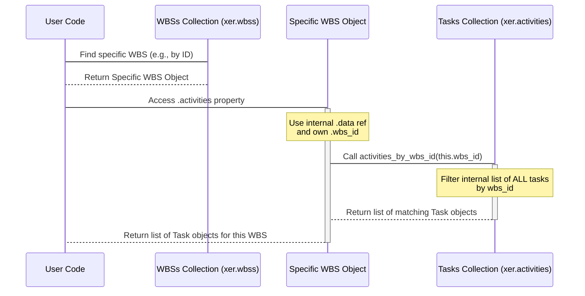

# Chapter 5: WBS (Work Breakdown Structure)

Welcome back! In the last few chapters, we've built up our understanding of how Alt-Ctrl-Proj helps us work with XER files. We saw how the [Reader](01_reader_.md) loads everything, how [Data Collections](02_data_collections_.md) organize the different types of data, how the [Project](03_project_.md) object represents the overall schedule container, and most importantly, how [Task (Activity)](04_task__activity__.md) objects represent the individual pieces of work.

But a project schedule isn't just a flat list of tasks. Tasks are usually organized into logical groups and sub-groups to help manage and understand the project's scope. This organized structure is called the **Work Breakdown Structure (WBS)**.

## What is WBS (Work Breakdown Structure)?

Imagine your project schedule is like a huge filing cabinet filled with index cards (your tasks). If you just dumped all the cards into one big drawer, finding anything would be a nightmare! Instead, you organize the cabinet using folders and sub-folders based on different phases of the project, major deliverables, or functional areas.

The Work Breakdown Structure (WBS) in project management is exactly like that folder system. It's a hierarchical (tree-like) structure that breaks down the entire project scope into smaller, more manageable components called WBS elements. Each WBS element represents a specific part of the project, and tasks are assigned to the lowest level of this structure.

In Primavera P6 and in Alt-Ctrl-Proj, **WBS objects** represent these folders and sub-folders. They show how the project is broken down organizationally.

Why is WBS important?

* **Organization:** It provides a clear structure for managing the project scope.
* **Navigation:** It helps you quickly locate tasks related to a specific phase or deliverable.
* **Reporting:** You can summarize progress, costs, and other data rolling up from tasks to their WBS elements.

Our goal in this chapter is to learn how to access and work with `WBS` objects in Alt-Ctrl-Proj to understand the project's structural breakdown and find tasks within specific WBS areas.

## Accessing WBS Objects

Just like other data types in your XER file, WBS elements are loaded by the [Reader](01_reader_.md) and stored in a dedicated **Data Collection**. You can access the collection of all WBS elements using the `xer.wbss` attribute:

```python
from xerparser_dev.reader import Reader

# Load your XER file
try:
    xer = Reader("my_project.xer")
    print("File loaded successfully!")
except FileNotFoundError:
    print("Error: my_project.xer not found.")
    exit()
except Exception as e:
    print(f"An error occurred: {e}")
    exit()

# Access the collection of all WBS elements
all_wbss = xer.wbss

print(f"\nFound {len(all_wbss._wbss)} total WBS elements in the file.")
```

The `xer.wbss` attribute gives you an instance of the `WBSs` collection class. Similar to the `Tasks` collection we saw in [Chapter 4: Task (Activity)](04_task__activity__.md), this collection is iterable and provides methods to help you work with `WBS` objects.

## Exploring the WBS Hierarchy

A WBS structure is hierarchical, meaning elements have parent-child relationships. The top-level WBS element (often representing the project itself) has no parent. Other WBS elements have a `parent_wbs_id` that links them to the element directly above them in the hierarchy.

Let's iterate through the `wbss` collection and print the name and parent ID for the first few WBS elements to see this structure:

```python
# Print details for the first few WBS elements
print("\nFirst 5 WBS elements:")

# Iterate directly over the collection
for i, wbs in enumerate(xer.wbss):
    if i >= 5: # Stop after the first 5 for this example
        break
    # 'wbs' is a single WBS object
    print(f"{i+1}. Name: {wbs.wbs_name}, Parent ID: {wbs.parent_wbs_id}")
```

**What this code does:**

1. `for i, wbs in enumerate(xer.wbss):`: This loop iterates through the `xer.wbss` collection. In each loop, `wbs` becomes the next `WBS` object.
2. `if i >= 5: break`: Limits the output to the first 5.
3. `print(...)`: Inside the loop, we access attributes of the current `WBS` object: `wbs.wbs_name` (the name of the WBS element) and `wbs.parent_wbs_id` (the ID of its parent WBS). You might see `None` for the `parent_wbs_id` for the top-level WBS elements.

Understanding the `parent_wbs_id` is key to programmatically building or visualizing the WBS tree structure if needed.

## Finding a Specific WBS Element

If you know the unique internal ID of a WBS element, you can find it directly using the `find_by_id` method on the `wbss` collection:

```python
# Assuming you know a WBS ID, e.g., 1002 (replace with a real ID from your file)
wbs_id_to_find = 1002

# Use the find_by_id method on the wbss collection
specific_wbs_by_id = xer.wbss.find_by_id(wbs_id_to_find)

if specific_wbs_by_id:
    print(f"\nFound WBS with ID {wbs_id_to_find}:")
    print(f"  Name: {specific_wbs_by_id.wbs_name}")
    print(f"  Parent ID: {specific_wbs_by_id.parent_wbs_id}")
else:
    print(f"\nWBS with ID {wbs_id_to_find} not found.")
```

This is much more efficient than looping through all WBS elements manually.

You can also get all WBS elements belonging to a specific project ID using the `get_by_project` method, which is useful if your XER file contains multiple projects:

```python
# Assuming you have a Project object from Chapter 3, e.g., main_project
# If not, let's just grab the first project's ID
if xer.projects:
    project_id_to_filter = xer.projects[0].proj_id
    print(f"\nFinding WBS elements for Project ID: {project_id_to_filter}")

    # Use the get_by_project method on the wbss collection
    wbss_for_project = xer.wbss.get_by_project(project_id_to_filter)

    print(f"  Found {len(wbss_for_project)} WBS elements in this project.")

    # You can then iterate through this filtered list
    # for i, wbs in enumerate(wbss_for_project[:5]):
    #    print(f"  - {wbs.wbs_name}")
else:
    print("\nNo projects found to filter WBS elements by.")

```

## Finding Tasks Within a WBS Element (The Use Case!)

The primary purpose of WBS is to organize tasks. A `WBS` object in Alt-Ctrl-Proj makes it easy to find all the tasks that are assigned *directly* to that specific WBS element.

Each `WBS` object has an `.activities` property. When you access this property, it gives you a list of all the `Task` objects whose `wbs_id` matches this WBS element's `wbs_id`.

Let's find a WBS element (e.g., by ID) and then list the tasks assigned to it:

```python
# Assuming 'specific_wbs_by_id' holds a WBS object from a previous step
# Or find one again:
wbs_id_to_check_tasks = 1002 # Replace with a real WBS ID from your file
wbs_element = xer.wbss.find_by_id(wbs_id_to_check_tasks)

if wbs_element:
    print(f"\nListing tasks directly assigned to WBS: '{wbs_element.wbs_name}' (ID: {wbs_element.wbs_id})")

    # Access the .activities property
    tasks_in_wbs = wbs_element.activities

    if tasks_in_wbs:
        print(f"  Found {len(tasks_in_wbs)} task(s):")
        # Iterate through the tasks found in this WBS
        for i, task in enumerate(tasks_in_wbs):
            # 'task' here is a Task object, just like in Chapter 4
            print(f"  {i+1}. {task.task_code} - {task.task_name}")
    else:
        print("  No tasks directly assigned to this WBS element.")

else:
    print(f"\nWBS with ID {wbs_id_to_check_tasks} not found.")

```

**Explanation:**

1. We first obtain a specific `WBS` object (e.g., using `find_by_id`).
2. We then access `wbs_element.activities`. This property performs the necessary lookup (behind the scenes) in the main `xer.activities` collection to find all tasks that have `wbs_id` matching the current `wbs_element.wbs_id`.
3. The result is a standard Python list containing `Task` objects.
4. We can then loop through this list and access the details of each task just as we learned in [Chapter 4: Task (Activity)](04_task__activity__.md).

This `.activities` property is your direct link from a WBS element to the tasks it contains.

## Under the Hood: How WBS Objects and Links Work

Let's peek behind the curtain to understand how Alt-Ctrl-Proj handles WBS objects and their relationship with tasks.

1. **Reading the XER:** The [Reader](01_reader_.md) processes the XER file. When it encounters lines for the `PROJWBS` table, it creates a `WBS` object for each `%R` record, similar to how it creates `Project` and `Task` objects.
2. **Storing WBS Objects:** The `Reader` adds each newly created `WBS` object to the `_wbss` attribute, which is an instance of the `WBSs` collection class (`xerparser_dev/model/wbss.py`). This collection holds *all* WBS objects loaded from the file.
3. **WBS Object Structure:** Each `WBS` object (`xerparser_dev/model/classes/wbs.py`) stores its raw data attributes (like `wbs_id`, `wbs_name`, `parent_wbs_id`, `proj_id`). Crucially, it also stores a reference back to the main data container (`self.data`), which holds references to *all* the collections, including `xer.activities` (which is `self.data.tasks` internally).
4. **Linking WBS to Tasks:** When you access the `wbs.activities` property:
    * The `WBS` object uses its stored `self.data` reference to access the main `Tasks` collection (`self.data.tasks`).
    * It calls a method on the `Tasks` collection (specifically, `activities_by_wbs_id`) and passes its own `wbs_id` as an argument.
    * The `Tasks` collection object then efficiently searches its internal list of *all* tasks and returns only those `Task` objects whose `wbs_id` attribute matches the ID requested by the WBS object.

Here's a simplified sequence diagram showing how accessing `wbs.activities` works:



This clarifies that the heavy lifting of finding the tasks belonging to a WBS is done by the central `Tasks` collection, orchestrated by the `WBS` object. This design keeps objects interconnected without duplicating large amounts of data.

## Key Attributes of the WBS Object

Here are some of the commonly used attributes and properties available on a `WBS` object:

| Attribute / Property | Type      | Description                                       |
| :------------------- | :-------- | :------------------------------------------------ |
| `wbs_id`             | `int`     | Unique internal database ID of the WBS element.   |
| `proj_id`            | `int`     | ID of the project this WBS belongs to.            |
| `wbs_name`           | `str`     | The full name of the WBS element.                 |
| `wbs_short_name`     | `str`     | The short name or code for the WBS element.       |
| `parent_wbs_id`      | `int`     | ID of the parent WBS element in the hierarchy. `None` for top-level. |
| `status_code`        | `str`     | Status of the WBS element.                        |
| `activities`         | `list` (`Task`) | List of `Task` objects directly assigned to this WBS. |

You can refer to the `WBS` class source code (`xerparser_dev/model/classes/wbs.py`) for the complete list of attributes available.

## Conclusion

In this chapter, you've learned about the Work Breakdown Structure (WBS) in Alt-Ctrl-Proj and how it helps organize your project schedule. You now know how to:

* Access the collection of all WBS elements using `xer.wbss`.
* Understand the hierarchical nature of WBS elements using the `parent_wbs_id` attribute.
* Find a specific WBS element by its ID or retrieve WBS elements for a specific project.
* Crucially, use the `wbs.activities` property to easily get a list of all tasks that belong directly to a particular WBS element, fulfilling our central use case.

Understanding WBS is vital for navigating large schedules and analyzing data based on project structure. You can now not only see the individual tasks but also understand how they fit into the overall project hierarchy.

What connects these tasks together and defines the project sequence? That's the subject of our next chapter: the relationships between tasks.

Let's move on to [Chapter 6: Relationship (TaskPred)](06_relationship__taskpred__.md) to explore how tasks are linked by dependencies.

---

<sub><sup>Generated by [AI Codebase Knowledge Builder](https://github.com/The-Pocket/Tutorial-Codebase-Knowledge).</sup></sub> <sub><sup>**References**: [[1]](https://github.com/osama-ata/Alt-Ctrl-Proj/blob/61f38213dc38bccd4d84cb765b1a5678723c47c2/docs/source/getting_started.rst), [[2]](https://github.com/osama-ata/Alt-Ctrl-Proj/blob/61f38213dc38bccd4d84cb765b1a5678723c47c2/xerparser_dev/model/classes/wbs.py), [[3]](https://github.com/osama-ata/Alt-Ctrl-Proj/blob/61f38213dc38bccd4d84cb765b1a5678723c47c2/xerparser_dev/model/wbss.py), [[4]](https://github.com/osama-ata/Alt-Ctrl-Proj/blob/61f38213dc38bccd4d84cb765b1a5678723c47c2/xerparser_dev/reader.py), [[5]](https://github.com/osama-ata/Alt-Ctrl-Proj/blob/61f38213dc38bccd4d84cb765b1a5678723c47c2/xerparser_dev/tools/explorer.py)</sup></sub>
