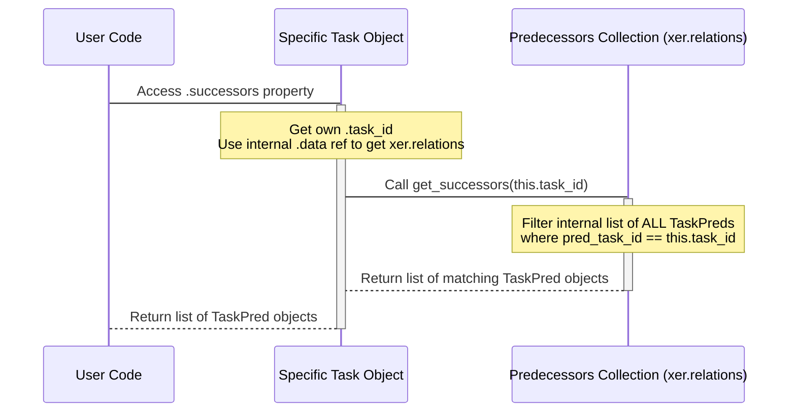

# Chapter 6: Relationship (TaskPred)

Welcome back! We've covered how the [Reader](01_reader_.md) loads your XER file, how data is organized into [Collections](02_data_collections_.md), how the [Project](03_project_.md) object represents the overall container, how [Task (Activity)](04_task__activity__.md) objects are the individual work items, and how [WBS (Work Breakdown Structure)](05_wbs__work_breakdown_structure__.md) organizes those tasks.

But how do we know *when* each task should happen relative to others? How does Primavera P6 figure out the schedule sequence? This is where **Relationships** come in.

## What is a Relationship (TaskPred) Object?

Imagine your tasks are like building blocks. You can't just stack them randomly; some blocks need to be placed before others. Relationships are the 'rules' or 'connectors' between these blocks (tasks) that dictate the order and timing.

In Primavera P6 terminology, these relationships are often called **Dependencies** or **Predecessors/Successors**. The task that must happen *first* is the **Predecessor**, and the task that must happen *after* is the **Successor**.

In Alt-Ctrl-Proj, each one of these connections between two tasks is represented by a **`TaskPred` object**. (`TaskPred` stands for "Task Predecessor", because the relationship is typically defined from the perspective of the successor task looking back at its predecessor).

A `TaskPred` object holds key information about a single link:

* Which task is the **Predecessor**.
* Which task is the **Successor**.
* The **Type** of the relationship (e.g., Finish-to-Start).
* Any **Lag** or **Lead** time between them.

These objects are absolutely essential for understanding the logic and flow of your schedule.

## Accessing Relationship Objects

Just like tasks, WBS elements, and projects, all the relationships in your XER file are loaded by the [Reader](01_reader_.md) and stored in a dedicated **Data Collection**. You access the collection of all relationships using the `xer.relations` attribute:

```python
from xerparser_dev.reader import Reader

# Load your XER file
try:
    xer = Reader("my_project.xer")
    print("File loaded successfully!")
except FileNotFoundError:
    print("Error: my_project.xer not found.")
    exit() # Stop if the file isn't found
except Exception as e:
    print(f"An error occurred: {e}")
    exit()

# Access the collection of all relationships
all_relations = xer.relations

# The relations collection holds TaskPred objects
print(f"\nFound {all_relations.count()} total relationships in the file.")
```

The `xer.relations` attribute is an instance of the `Predecessors` collection class. Yes, the collection name is `Predecessors`, which might seem a bit confusing, but it's the collection that holds all the `TaskPred` objects representing the predecessor-successor links.

Like other collections, `xer.relations` is iterable, allowing you to loop through all the relationship objects it contains.

## Exploring Relationships

Let's iterate through the `xer.relations` collection and print some details about the first few relationships to see what they look like:

```python
# Print details for the first few relationships
print("\nFirst 5 relationships:")

# Iterate directly over the collection
for i, relation in enumerate(xer.relations):
    if i >= 5: # Stop after the first 5 for this example
        break
    # 'relation' is a single TaskPred object
    # We can access its attributes
    print(f"{i+1}. Predecessor Task ID: {relation.pred_task_id}")
    print(f"   Successor Task ID: {relation.task_id}")
    print(f"   Type: {relation.pred_type}")
    # Lag is in hours in the raw data, often converted to days for display
    # Assume an 8-hour day for simple conversion
    lag_days = relation.lag_hr_cnt / 8.0 if relation.lag_hr_cnt is not None else 0
    print(f"   Lag (days): {lag_days}")
```

**What this code does:**

1. `for i, relation in enumerate(xer.relations):`: Loops through the `xer.relations` collection. `relation` becomes the next `TaskPred` object in each loop.
2. `if i >= 5: break`: Limits the output.
3. `print(...)`: Accesses attributes of the current `TaskPred` object:
    * `relation.pred_task_id`: The internal database ID of the predecessor task.
    * `relation.task_id`: The internal database ID of the successor task.
    * `relation.pred_type`: The type of relationship (like 'PR\_FS').
    * `relation.lag_hr_cnt`: The lag time in hours. We perform a simple division by 8 to show it in days, noting that this is an assumption.

This shows you the basic information contained within each `TaskPred` object. Note that these IDs (`pred_task_id`, `task_id`) are the same unique IDs (`task_id`) we saw on the [Task](04_task__activity__.md) objects. You'll need these IDs to link relationships back to the actual `Task` objects using the `xer.activities` collection.

## Finding Relationships for a Specific Task (Central Use Case)

A very common task is to find all the relationships connected to *one particular task*. For example, you might want to know:

1. What tasks **must finish or start *before* this task can start or finish**? (Its **Predecessors**)
2. What tasks **cannot finish or start *until* this task finishes or starts**? (Its **Successors**)

The `xer.relations` collection (the `Predecessors` object) provides methods to find these:

* `xer.relations.get_predecessors(task_id)`: Finds all `TaskPred` objects where the task with the given `task_id` is the **Successor**. (It gets the links *pointing into* this task).
* `xer.relations.get_successors(task_id)`: Finds all `TaskPred` objects where the task with the given `task_id` is the **Predecessor**. (It gets the links *pointing out of* this task).

Let's find a specific task (like we did in Chapter 4) and then list its predecessors and successors using these methods:

```python
# First, find a task (replace with a real ID from your file)
task_id_to_check = 12345
target_task = xer.activities.find_by_id(task_id_to_check)

if target_task:
    print(f"\nExamining relationships for Task: '{target_task.task_code} - {target_task.task_name}' (ID: {target_task.task_id})")

    # 1. Get its predecessors (links coming *into* this task)
    predecessor_relations = xer.relations.get_predecessors(target_task.task_id)

    print(f"\n  Predecessor Relationships ({len(predecessor_relations)} found):")
    if predecessor_relations:
        for i, rel in enumerate(predecessor_relations):
            # rel is a TaskPred object
            # To get the predecessor TASK object, we use its ID (rel.pred_task_id)
            pred_task = xer.activities.find_by_id(rel.pred_task_id)
            pred_code = pred_task.task_code if pred_task else "Unknown Task"
            lag_days = rel.lag_hr_cnt / 8.0 if rel.lag_hr_cnt is not None else 0
            print(f"  {i+1}. Predecessor: {pred_code} (ID: {rel.pred_task_id})")
            print(f"     Type: {rel.pred_type}, Lag (days): {lag_days}")
    else:
        print("  No predecessor relationships found.")

    # 2. Get its successors (links going *out of* this task)
    successor_relations = xer.relations.get_successors(target_task.task_id)

    print(f"\n  Successor Relationships ({len(successor_relations)} found):")
    if successor_relations:
        for i, rel in enumerate(successor_relations):
            # rel is a TaskPred object
            # To get the successor TASK object, we use its ID (rel.task_id)
            succ_task = xer.activities.find_by_id(rel.task_id)
            succ_code = succ_task.task_code if succ_task else "Unknown Task"
            lag_days = rel.lag_hr_cnt / 8.0 if rel.lag_hr_cnt is not None else 0
            print(f"  {i+1}. Successor: {succ_code} (ID: {rel.task_id})")
            print(f"     Type: {rel.pred_type}, Lag (days): {lag_days}")
    else:
        print("  No successor relationships found.")

else:
    print(f"\nTask with ID {task_id_to_check} not found.")
```

**Explanation:**

1. We first get the `Task` object we're interested in using `xer.activities.find_by_id`.
2. We call `xer.relations.get_predecessors()` passing the `task_id` of our target task. This returns a *list of `TaskPred` objects* where our target task is the successor.
3. We loop through this list of `TaskPred` objects. For each `TaskPred`, we get the `pred_task_id` (the ID of the predecessor task). We then use `xer.activities.find_by_id(rel.pred_task_id)` to retrieve the actual *Predecessor `Task` object* so we can get its name or code.
4. We do a similar process for `xer.relations.get_successors()`, which returns a list of `TaskPred` objects where our target task is the predecessor. We loop through these and find the *Successor `Task` objects* using `rel.task_id`.

This pattern of getting a relationship object (`TaskPred`) and then using the task IDs within it to retrieve the corresponding `Task` objects from the main `xer.activities` collection is fundamental to working with relationships in Alt-Ctrl-Proj.

*(Self-Correction):* In Chapter 4, we briefly mentioned `task.predecessors` and `task.successors` properties. These properties on the `Task` object are just convenient shortcuts that internally call the `xer.relations.get_predecessors()` and `xer.relations.get_successors()` methods, passing the task's own ID. You can use `target_task.predecessors` and `target_task.successors` directly if you prefer, which is slightly cleaner:

```python
# Alternative (cleaner) way using Task object properties
if target_task:
    print(f"\nExamining relationships using Task object properties for Task: '{target_task.task_code}'")

    # Using the .predecessors property on the Task object
    pred_relations_via_prop = target_task.predecessors
    print(f"\n  Predecessor Relationships (via property) ({len(pred_relations_via_prop)} found):")
    # Loop and print details as before... (code omitted for brevity)

    # Using the .successors property on the Task object
    succ_relations_via_prop = target_task.successors
    print(f"\n  Successor Relationships (via property) ({len(succ_relations_via_prop)} found):")
    # Loop and print details as before... (code omitted for brevity)
```

Both approaches achieve the same result; using the properties on the `Task` object is often more intuitive.

## Understanding Relationship Details (Attributes)

Let's look closer at the attributes of a `TaskPred` object:

* `task_pred_id` (string): A unique identifier for the relationship itself.
* `task_id` (int): The database ID of the **Successor** task.
* `pred_task_id` (int): The database ID of the **Predecessor** task.
* `pred_type` (string): The type of dependency. Common values are:
  * `PR_FS`: **Finish-to-Start** (Successor starts after Predecessor finishes) - The most common type.
  * `PR_SS`: **Start-to-Start** (Successor starts after Predecessor starts)
  * `PR_FF`: **Finish-to-Finish** (Successor finishes after Predecessor finishes)
  * `PR_SF`: **Start-to-Finish** (Successor finishes after Predecessor starts)
* `lag_hr_cnt` (float): The lag or lead time in **hours**.
  * Positive values represent **Lag** (a delay between the predecessor event and the successor event). E.g., FS+2 days lag means 2 days *after* the predecessor finishes, the successor can start.
  * Negative values represent **Lead** (an acceleration, allowing the successor event to happen before the predecessor event is complete). E.g., FS-1 day lead means the successor can start 1 day *before* the predecessor finishes.

* `proj_id` (int): The project ID of the successor task.
* `pred_proj_id` (int): The project ID of the predecessor task. These will often be the same for typical project scheduling.
* Other attributes like `float_path`, `comments`, etc. might also be present depending on the XER file details.

Understanding these attributes allows you to fully interpret the connection between two tasks.

## Under the Hood: How Relationships Are Managed

Let's see how the `Reader` and the `Predecessors` collection work together to handle relationships.

1. **Reading the XER:** The [Reader](01_reader_.md) processes the XER file line by line. When it finds lines for the `TASKPRED` table, it identifies this section.
2. **Storing Relationship Objects:** For each `%R` record in the `TASKPRED` section, the `Reader` parses the data and calls its `create_object` method, identifying the type as "TASKPRED". This method then calls the `add` method on the `_predecessors` attribute (which is the `Predecessors` collection instance).

    ```python
    # Inside Reader.create_object (simplified)
    # ...
    elif object_type.strip() == "TASKPRED":
        # The Reader gets the raw data (params) for one relationship.
        # It calls the 'add' method on the Predecessors collection (_predecessors).
        self._predecessors.add(params) # No data reference needed here usually
    # ...
    ```

3. **Creating TaskPred Objects:** The `Predecessors` collection's `add` method (`xerparser_dev/model/predecessors.py`) receives the raw data (`params`), creates a `TaskPred` object (`xerparser_dev/model/classes/taskpred.py`) from it, and appends it to its internal list (`self.task_pred`).

    ```python
    # Inside xerparser_dev/model/predecessors.py, in the Predecessors class add method
        def add(self, params: dict[str, Any]) -> None:
            # Create the TaskPred object using the raw data (params)
            pred = TaskPred(params)
            # Add the newly created TaskPred object to the collection's internal list
            self.task_pred.append(pred)
    ```

4. **Finding Related Relationships:** When you call `xer.relations.get_successors(task_id)` or `xer.relations.get_predecessors(task_id)`, the `Predecessors` collection object searches its internal list (`self.task_pred`) to find all `TaskPred` objects where either `pred_task_id` (for successors) or `task_id` (for predecessors) matches the requested `task_id`.

    ```python
    # Inside xerparser_dev/model/predecessors.py (simplified methods)
        def get_successors(self, act_id: int) -> list[TaskPred]:
            """Find relationships where act_id is the PREDECESSOR."""
            # Filter the internal list where pred_task_id matches act_id
            return list(filter(lambda x: x.pred_task_id == act_id, self.task_pred))

        def get_predecessors(self, act_id: int) -> list[TaskPred]:
            """Find relationships where act_id is the SUCCESSOR."""
            # Filter the internal list where task_id matches act_id
            return list(filter(lambda x: x.task_id == act_id, self.task_pred))
    ```

Here's a simplified sequence diagram showing how finding successors for a task works:



This shows how the `Task` object properties or direct calls to the `xer.relations` methods trigger a search within the central relationships collection.

## Key Attributes of the TaskPred Object

Here's a table summarizing the key attributes available on a `TaskPred` (Relationship) object:

| Attribute      | Type    | Description                                                               |
| :------------- | :------ | :------------------------------------------------------------------------ |
| `task_pred_id` | `str`   | Unique internal ID of the relationship.                                   |
| `task_id`      | `int`   | Database ID of the **Successor** task.                                    |
| `pred_task_id` | `int`   | Database ID of the **Predecessor** task.                                  |
| `pred_type`    | `str`   | Type of dependency ('PR_FS', 'PR_SS', 'PR_FF', 'PR_SF').                  |
| `lag_hr_cnt`   | `float` | Lag time in hours (positive = lag, negative = lead).                      |
| `proj_id`      | `int`   | Project ID of the successor task's project.                               |
| `pred_proj_id` | `int`   | Project ID of the predecessor task's project.                             |

## Conclusion

In this chapter, you've learned about the crucial concept of Relationships (`TaskPred` objects) in Primavera P6 and how they are represented in Alt-Ctrl-Proj. You now know how to:

* Access the collection of all relationships using `xer.relations`.
* Iterate through relationship objects and understand their core attributes like predecessor/successor IDs, type, and lag.
* Find all relationships connected to a specific task using `xer.relations.get_predecessors()` and `xer.relations.get_successors()`, or the convenient `task.predecessors` and `task.successors` properties.
* Understand the different relationship types (FS, SS, FF, SF) and the meaning of lag/lead time.
* See how the `Reader` and the `Predecessors` collection store and retrieve these vital links.

Understanding how tasks are linked is fundamental to analyzing schedule logic, identifying critical paths, and assessing schedule quality. You can now navigate the connections between your tasks.

What else is assigned to tasks and is critical for understanding resource loading and costs? That's our next topic.

Let's move on to [Chapter 7: Resource](07_resource_.md) to explore resource assignments.

---

<sub><sup>Generated by [AI Codebase Knowledge Builder](https://github.com/The-Pocket/Tutorial-Codebase-Knowledge).</sup></sub> <sub><sup>**References**: [[1]](https://github.com/osama-ata/Alt-Ctrl-Proj/blob/61f38213dc38bccd4d84cb765b1a5678723c47c2/docs/source/examples.rst), [[2]](https://github.com/osama-ata/Alt-Ctrl-Proj/blob/61f38213dc38bccd4d84cb765b1a5678723c47c2/docs/source/getting_started.rst), [[3]](https://github.com/osama-ata/Alt-Ctrl-Proj/blob/61f38213dc38bccd4d84cb765b1a5678723c47c2/xerparser_dev/dcma14/analysis.py), [[4]](https://github.com/osama-ata/Alt-Ctrl-Proj/blob/61f38213dc38bccd4d84cb765b1a5678723c47c2/xerparser_dev/model/classes/taskpred.py), [[5]](https://github.com/osama-ata/Alt-Ctrl-Proj/blob/61f38213dc38bccd4d84cb765b1a5678723c47c2/xerparser_dev/model/predecessors.py), [[6]](https://github.com/osama-ata/Alt-Ctrl-Proj/blob/61f38213dc38bccd4d84cb765b1a5678723c47c2/xerparser_dev/reader.py)</sup></sub>
