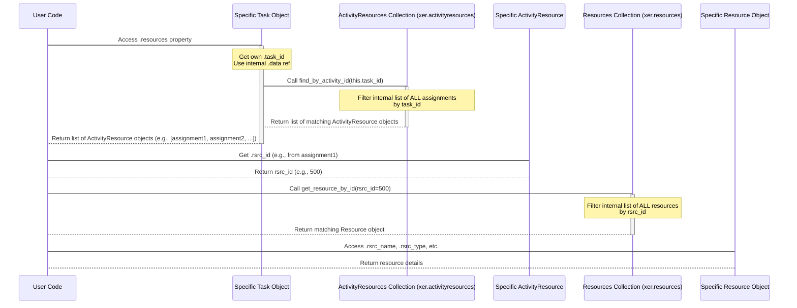

# Chapter 7: Resource

Welcome back! We've covered how the [Reader](01_reader_.md) loads your XER file, how data is organized into [Collections](02_data_collections_.md), how the [Project](03_project_.md) object represents the overall container, how [Task (Activity)](04_task__activity__.md) objects are the individual work items, how [WBS (Work Breakdown Structure)](05_wbs__work_breakdown_structure__.md) organizes those tasks, and how [Relationships (TaskPred)](06_relationship__taskpred_.md) link tasks together.

But who or what actually *does* the work described by the tasks? That's where **Resources** come in. Resources are the people, equipment, or materials you need to complete your project activities. Understanding which resources are assigned to which tasks is crucial for resource planning, cost tracking, and identifying potential overloads.

In Primavera P6 and Alt-Ctrl-Proj, resources themselves and their assignment to tasks are represented by specific objects.

## What are Resource Objects?

Think of a resource in Primavera P6 like an entry in a company directory or an inventory list. It defines a type of capacity or material available for the project.

In Alt-Ctrl-Proj, a **`Resource` object** is the Python representation of one of these entries. When the [Reader](01_reader_.md) processes the `RSRC` (Resource) section of the XER file, it creates a `Resource` object for each resource it finds.

A `Resource` object holds information *about* the resource itself, such as:

* Its unique ID.
* Its name (e.g., "Civil Engineer," "Crane #1," "Concrete").
* Its type (Labor, Non-Labor, or Material).
* Which [Calendar](01_reader_.md) it uses (important for Labor/Non-Labor availability).
* Cost rates.
* Parent resource if they are organized hierarchically.

However, a `Resource` object **does not directly tell you *which tasks* it is assigned to**. It's just the definition of the resource. To find assignments, we need another type of object.

## What are Resource Assignment Objects?

A `Resource` object is like the "Civil Engineer" entry in the directory. A **Resource Assignment** is like saying "Assign 8 hours of 'Civil Engineer' time to the 'Excavate Site' task."

In Primavera P6, these assignments are often found in the `TASKRSRC` table of an XER file. In Alt-Ctrl-Proj, each assignment is represented by an **`ActivityResource` object**.

An `ActivityResource` object is the Python representation of a *single link* between a **Task** and a **Resource**. It holds information *about that specific assignment*, such as:

* The ID of the **Task** it's assigned to.
* The ID of the **Resource** being assigned.
* How many units are assigned (e.g., hours, tons, pieces).
* Planned, remaining, and actual units.
* Cost details for this specific assignment.

To understand resource usage in your schedule, you typically need to work with both `Resource` objects (to get resource names, types, etc.) and `ActivityResource` objects (to see the assignments and quantities).

## Accessing Resource Objects and Collections

Just like tasks and relationships, resources and resource assignments are organized into separate **Data Collections** by the [Reader](01_reader_.md).

* The collection of all **`Resource` objects** is accessed via `xer.resources`.
* The collection of all **`ActivityResource` objects** (the assignments) is accessed via `xer.activityresources`.

Let's load a file and access these collections:

```python
from xer_parser.reader import Reader

# Load your XER file
try:
    xer = Reader("my_project.xer")
    print("File loaded successfully!")
except FileNotFoundError:
    print("Error: my_project.xer not found.")
    exit()
except Exception as e:
    print(f"An error occurred: {e}")
    exit()

# Access the collection of all Resources
all_resources = xer.resources
print(f"\nFound {len(all_resources._rsrcs)} total resources defined.")

# Access the collection of all Resource Assignments
all_assignments = xer.activityresources
print(f"Found {all_assignments.count()} total resource assignments.")

```

The `xer.resources` attribute gives you an instance of the `Resources` collection, and `xer.activityresources` gives you an instance of the `ActivityResources` collection. Both are iterable and provide methods to find specific objects.

## Exploring Resources

Let's iterate through the `xer.resources` collection and print details about the first few resources:

```python
# Print details for the first few resources
print("\nFirst 5 resources:")

# Iterate directly over the collection
for i, resource in enumerate(xer.resources):
    if i >= 5: # Stop after the first 5 for this example
        break
    # 'resource' is a single Resource object
    print(f"{i+1}. ID: {resource.rsrc_id}, Name: {resource.rsrc_name}, Type: {resource.rsrc_type}")

```

This shows you the basic properties of the `Resource` objects defined in your XER file.

## Finding a Specific Resource

If you know the unique internal ID of a resource, you can find it quickly using `find_by_id` on the `xer.resources` collection:

```python
# Assuming you know a Resource ID, e.g., 500 (replace with a real ID from your file)
resource_id_to_find = 500

# Use the find_by_id method on the resources collection
specific_resource = xer.resources.get_resource_by_id(resource_id_to_find) # Note: method name is get_resource_by_id

if specific_resource:
    print(f"\nFound Resource with ID {resource_id_to_find}:")
    print(f"  Name: {specific_resource.rsrc_name}")
    print(f"  Type: {specific_resource.rsrc_type}")
    print(f"  Calendar ID: {specific_resource.clndr_id}")
else:
    print(f"\nResource with ID {resource_id_to_find} not found.")
```

## The Use Case: Finding Resources Assigned to a Task

The most common way you'll interact with resources in the context of a schedule analysis is by looking at the resources *assigned to specific tasks*.

As mentioned earlier, the link between a task and a resource is an `ActivityResource` object. A `Task` object in Alt-Ctrl-Proj has a convenient property `.resources` that gives you a list of all `ActivityResource` objects assigned to that task.

Let's find a task (like we did in Chapter 4) and then list the resources assigned to it:

```python
# First, find a task (replace with a real ID from your file)
task_id_to_check = 12345 # Replace with a real Task ID

# Use the activities collection to find the task
target_task = xer.activities.find_by_id(task_id_to_check)

if target_task:
    print(f"\nExamining resources assigned to Task: '{target_task.task_code} - {target_task.task_name}' (ID: {target_task.task_id})")

    # Access the .resources property on the Task object
    task_assignments = target_task.resources # This gives a list of ActivityResource objects

    if task_assignments:
        print(f"\n  Resource Assignments ({len(task_assignments)} found):")
        # Iterate through the ActivityResource objects for this task
        for i, assignment in enumerate(task_assignments):
            # 'assignment' is a single ActivityResource object

            # We need the Resource object itself to get the name, type, etc.
            resource_id = assignment.rsrc_id
            assigned_resource = xer.resources.get_resource_by_id(resource_id)

            resource_name = assigned_resource.rsrc_name if assigned_resource else "Unknown Resource"
            resource_type = assigned_resource.rsrc_type if assigned_resource else "N/A"

            # Access details from the ActivityResource object itself
            assigned_units = assignment.remain_qty if assignment.remain_qty is not None else 0 # Example: Remaining Units
            cost_per_unit = assignment.cost_per_qty if assignment.cost_per_qty is not None else 0 # Example: Rate

            print(f"  {i+1}. Resource ID: {resource_id} ({resource_type})")
            print(f"     Name: {resource_name}")
            print(f"     Assigned Units (Remaining): {assigned_units}")
            print(f"     Rate (Cost per Unit): {cost_per_unit}")
    else:
        print("  No resource assignments found for this task.")

else:
    print(f"\nTask with ID {task_id_to_check} not found.")
```

**Explanation:**

1. We first get the `Task` object we are interested in using the `xer.activities` collection.
2. We access `target_task.resources`. This property looks up all `ActivityResource` objects in the `xer.activityresources` collection whose `task_id` matches the `target_task.task_id`. It returns a list of those matching `ActivityResource` objects.
3. We loop through this list of `ActivityResource` objects.
4. For each `ActivityResource` (`assignment`), we get its `rsrc_id` (the ID of the resource assigned).
5. We use `xer.resources.get_resource_by_id(resource_id)` to find the actual `Resource` object corresponding to that ID so we can get its name, type, etc.
6. Finally, we print details by combining information from the `ActivityResource` object (`assigned_units`, `cost_per_unit`) and the related `Resource` object (`resource_name`, `resource_type`).

This is the standard pattern: get the assignment (`ActivityResource`) from the task, then use the assignment's resource ID to get the resource details (`Resource`).

## Under the Hood: How Resources and Assignments are Linked

Let's trace what happens internally when you access `task.resources` and then get the resource details.

1. **Reading the XER:** The [Reader](01_reader_.md) processes the XER file. When it encounters lines for the `RSRC` table, it creates `Resource` objects and adds them to the `_resources` attribute (`xer.resources` collection). When it encounters lines for the `TASKRSRC` table, it creates `ActivityResource` objects and adds them to the `_activityresources` attribute (`xer.activityresources` collection).
2. **Task Object Property:** The `Task` object (`xer_parser/model/classes/task.py`) has a property called `resources`.

    ```python
    # Inside Task class (xer_parser/model/classes/task.py)
        @property
        def resources(self) -> list[Any]:
            """
            Get all activity resources (assignments) for this task.
            """
            # Use the stored reference to the main data container (self.data)
            # Access the main activity resources collection (self.data.taskresource)
            # Call the find_by_activity_id method on the collection,
            # passing THIS task's ID (self.task_id)
            return self.data.taskresource.find_by_activity_id(self.task_id)
    ```

    When you access `task.resources`, this property internally calls the `find_by_activity_id` method on the central `ActivityResources` collection (`xer.activityresources`), passing the task's own `task_id`.
3. **Finding Assignments by Task ID:** The `ActivityResources` collection (`xer_parser/model/activityresources.py`) stores all assignment objects in an internal list (`self._taskresources`). Its `find_by_activity_id` method filters this list.

    ```python
    # Inside ActivityResources collection (xer_parser/model/activityresources.py)
        def find_by_activity_id(self, id: int) -> list[ActivityResource]:
            """Find all activity resources for a given activity ID."""
            # Filter the internal list where task_id matches the given ID
            return list(filter(lambda x: x.task_id == id, self._taskresources))
    ```

    This method returns a list containing *only* the `ActivityResource` objects where the `task_id` matches the requested task.
4. **Finding Resource Details:** Once you have an `ActivityResource` object (`assignment`), you use its `rsrc_id` attribute (`assignment.rsrc_id`) to find the corresponding `Resource` object. You do this by calling `xer.resources.get_resource_by_id()`.

    ```python
    # Inside Resources collection (xer_parser/model/resources.py)
        def get_resource_by_id(self, id: int) -> Resource | None:
            """Find a resource by its ID."""
            # Filter the internal list of Resources where rsrc_id matches the given ID
            rsrc = list(filter(lambda x: x.rsrc_id == id, self._rsrcs))
            if len(rsrc) > 0:
                return rsrc[0] # Return the first match
            else:
                return None # Not found
    ```

    This method searches the `Resources` collection's internal list (`self._rsrcs`) for the `Resource` object with the matching `rsrc_id`.

Here's a simplified sequence diagram showing this interaction:



This diagram illustrates how you chain calls, first getting the assignment objects associated with a task, and then using the information within those assignment objects to retrieve the details of the assigned resources.

## Key Attributes of Resource and ActivityResource Objects

Here's a summary of common attributes:

**`Resource` Object (xer.resources collection)**

| Attribute         | Type    | Description                                       |
| :---------------- | :------ | :------------------------------------------------ |
| `rsrc_id`         | `int`   | Unique internal database ID of the resource.      |
| `rsrc_name`       | `str`   | The full name of the resource.                    |
| `rsrc_short_name` | `str`   | The short name or code for the resource.          |
| `rsrc_type`       | `str`   | Type of resource ('Labor', 'Nonlabor', 'Material'). |
| `clndr_id`        | `int`   | ID of the default calendar assigned to the resource. |
| `parent_rsrc_id`  | `int`   | ID of the parent resource for hierarchical structures. |
| `active_flag`     | `str`   | Indicates if the resource is active ('Y' or 'N'). |
| `def_qty_per_hr`  | `str`   | Default units per hour for this resource.         |
| `ot_factor`       | `str`   | Overtime factor.                                  |

**`ActivityResource` Object (xer.activityresources collection)**

| Attribute         | Type    | Description                                       |
| :---------------- | :------ | :------------------------------------------------ |
| `task_rsrc_id`    | `int`   | Unique internal database ID of the assignment.    |
| `task_id`         | `int`   | Database ID of the task this resource is assigned to. |
| `rsrc_id`         | `int`   | Database ID of the resource assigned.             |
| `proj_id`         | `int`   | Database ID of the project.                       |
| `role_id`         | `int`   | ID of the role assigned to this resource on this task. |
| `plan_qty`        | `float` | Planned units for this assignment.                |
| `target_qty`      | `float` | Target (baseline) units for this assignment.      |
| `remain_qty`      | `float` | Remaining units for this assignment.              |
| `act_qty`         | `float` | Actual units consumed for this assignment.        |
| `cost_per_qty`    | `float` | Standard cost rate per unit for this assignment.  |
| `cost_per_qty_times` | `str` | Unit of time for cost rate (e.g., '/hr').      |
| `start_date`      | `datetime` | Start date of this assignment.                |
| `end_date`        | `datetime` | End date of this assignment.                  |

This is not an exhaustive list, but covers many of the essential attributes you'll use regularly to analyze resource assignments.

## Conclusion

In this chapter, you've learned that working with resources in Alt-Ctrl-Proj involves two key types of objects: `Resource` objects (defining the resource itself) and `ActivityResource` objects (representing the assignment of a resource to a specific task).

You now know how to:

* Access the collection of all `Resource` objects using `xer.resources`.
* Access the collection of all `ActivityResource` objects using `xer.activityresources`.
* Explore basic resource details by iterating through `xer.resources`.
* Find a specific `Resource` object using its ID.
* Most importantly, you learned how to find the `ActivityResource` objects assigned to a specific task using the `task.resources` property and then use the `rsrc_id` from those assignments to retrieve the corresponding `Resource` objects from the `xer.resources` collection to get details like name and type.

Understanding resource assignments is vital for assessing resource loading, managing costs, and performing schedule health checks related to resources.

Now that you can access tasks, their relationships, and their resource assignments, you have the core building blocks to perform more complex schedule analyses. Our next chapter will introduce a common framework for doing just that.

Let's move on to [Chapter 8: DCMA14 Analysis](08_dcma14_analysis_.md) to see how Alt-Ctrl-Proj can help you assess schedule quality using standard metrics like the DCMA 14-point assessment.

---

<sub><sup>Generated by [AI Codebase Knowledge Builder](https://github.com/The-Pocket/Tutorial-Codebase-Knowledge).</sup></sub> <sub><sup>**References**: [[1]](https://github.com/osama-ata/Alt-Ctrl-Proj/blob/61f38213dc38bccd4d84cb765b1a5678723c47c2/docs/source/examples.rst), [[2]](https://github.com/osama-ata/Alt-Ctrl-Proj/blob/61f38213dc38bccd4d84cb765b1a5678723c47c2/xer_parser/model/classes/rsrc.py), [[3]](https://github.com/osama-ata/Alt-Ctrl-Proj/blob/61f38213dc38bccd4d84cb765b1a5678723c47c2/xer_parser/model/resources.py), [[4]](https://github.com/osama-ata/Alt-Ctrl-Proj/blob/61f38213dc38bccd4d84cb765b1a5678723c47c2/xer_parser/reader.py), [[5]](https://github.com/osama-ata/Alt-Ctrl-Proj/blob/61f38213dc38bccd4d84cb765b1a5678723c47c2/xer_parser/tools/explorer.py)</sup></sub>
