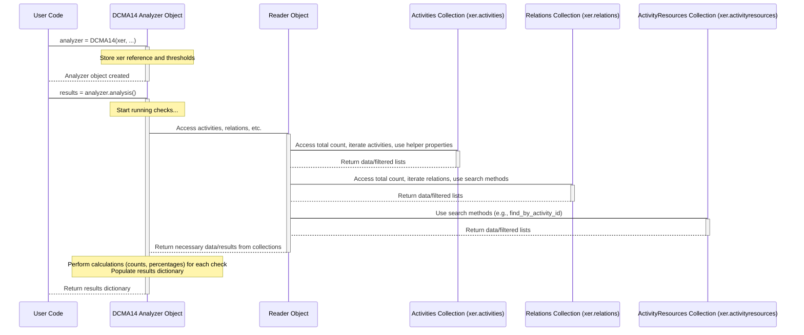

# Chapter 8: DCMA14 Analysis

Welcome back! In our journey through Alt-Ctrl-Proj, we've learned how the [Reader](01_reader_.md) loads your XER file, how data is organized into [Collections](02_data_collections_.md), how the [Project](03_project_.md) object represents the overall container, how [Task (Activity)](04_task__activity__.md) objects are the individual work items, how [WBS (Work Breakdown Structure)](05_wbs__work_breakdown_structure__.md) organizes those tasks, how [Relationships (TaskPred)](06_relationship__taskpred_.md) link tasks together, and how [Resource](07_resource_.md) assignments track who does the work.

With all these individual pieces of schedule data now accessible, you might wonder: how good is my schedule overall? Is it built correctly? Are there common mistakes that could make it unreliable?

This is where schedule *analysis* comes in. One of the most widely recognized standards for checking the quality of a schedule is the **DCMA 14-Point Assessment**, developed by the Defense Contract Management Agency. It's a checklist of common scheduling pitfalls.

Alt-Ctrl-Proj provides a dedicated tool to automatically perform this check for you: the **DCMA14 Analysis** abstraction.

## What is DCMA14 Analysis?

Imagine you have a checklist of 14 important things to look for when reviewing a schedule to make sure it's healthy and reliable. The DCMA 14-Point Assessment is exactly that – a checklist covering areas like:

* Are all tasks properly linked with predecessors and successors? (Missing Logic)
* Are there excessively long gaps (lags) between tasks?
* Are there tasks with extremely high or negative float?
* Are there tasks that are unrealistically long in duration?
* Are resources assigned to tasks?
* ...and other key indicators of a potentially problematic schedule.

Manually going through a large schedule to check each of these points for every activity and relationship would be incredibly time-consuming.

The `DCMA14` class in Alt-Ctrl-Proj is designed to automate this process. You give it your loaded schedule data, and it runs through these 14 checks, calculating metrics and identifying problematic areas. It's like having a built-in schedule health checker!

The **central use case** for `DCMA14` is to get a quick, standardized report on the quality of your schedule based on these well-established criteria.

## How to Perform a DCMA14 Analysis

Using the `DCMA14` analysis tool is straightforward. You need your loaded `Reader` object (which you learned how to create in [Chapter 1: Reader](01_reader_.md)), then you create an instance of the `DCMA14` class and call its `analysis()` method.

First, make sure you have imported the necessary class:

```python
from xer_parser.reader import Reader
from xer_parser.dcma14.analysis import DCMA14
```

Now, let's load your XER file and create the analyzer:

```python
# Load the XER file (replace 'my_project.xer' with your file)
try:
    xer = Reader("my_project.xer")
    print("File loaded successfully!")
except FileNotFoundError:
    print("Error: my_project.xer not found.")
    exit()
except Exception as e:
    print(f"An error occurred: {e}")
    exit()

# Create a DCMA14 analyzer object
# We pass the loaded Reader object 'xer' to it
analyzer = DCMA14(xer)

print("\nDCMA14 Analyzer created.")
```

When you create the `DCMA14` object like this (`analyzer = DCMA14(xer)`), it uses default thresholds for certain checks (e.g., flagging tasks longer than 1 day duration, lags longer than 0 days, or total float higher than 0 days).

Now, to run the actual analysis, call the `.analysis()` method:

```python
# Run the DCMA14 analysis
results = analyzer.analysis()

print("Analysis complete. Results available in the 'results' dictionary.")
```

The `.analysis()` method performs all the checks and returns a dictionary containing the results. This dictionary is structured to give you counts and percentages for each DCMA point.

## Accessing the Analysis Results

The `results` dictionary returned by `analyzer.analysis()` contains various keys representing different parts of the DCMA assessment. Each key typically holds another dictionary with details like the count of activities/relationships that failed the check (`'cnt'`), the percentage this represents of the total (`'pct'`), and sometimes lists of the problematic items themselves (`'activities'`, `'relations'`).

Let's access some of the key metrics:

```python
# Access key results from the analysis dictionary
analysis_data = results['analysis'] # The main analysis results are under the 'analysis' key

# 1. Missing Logic (Successors and Predecessors)
# Percentage of activities missing a successor relationship
missing_successors_pct = analysis_data['successors']['pct'] * 100
print(f"\nActivities missing successors: {missing_successors_pct:.1f}%")
# Percentage of activities missing a predecessor relationship
missing_predecessors_pct = analysis_data['predecessors']['pct'] * 100
print(f"Activities missing predecessors: {missing_predecessors_pct:.1f}%")

# 2. High Float
# Percentage of activities with Total Float above the threshold (default is > 0)
high_float_pct = analysis_data['totalfloat']['pct'] * 100
print(f"Activities with high float: {high_float_pct:.1f}%")

# 3. Negative Float
# Percentage of activities with Negative Float
neg_float_pct = analysis_data['negativefloat']['pct'] * 100
print(f"Activities with negative float: {neg_float_pct:.1f}%")

# 4. Long Durations
# Percentage of activities with duration longer than the threshold (default is > 1 day)
long_duration_pct = analysis_data['duration']['pct'] * 100
print(f"Activities with long duration: {long_duration_pct:.1f}%")

# 5. Resource Assignments
# Percentage of activities without assigned resources
no_resources_pct = analysis_data['resources']['pct'] * 100
print(f"Activities without resources: {no_resources_pct:.1f}%")

# You can also see the raw counts:
print(f"\nTotal Activities: {analysis_data['summary']['activity_cnt']}")
print(f"Total Relationships: {analysis_data['summary']['relationship_cnt']}")
```

This code snippet demonstrates how to navigate the `results` dictionary to find the calculated percentages for some of the most common DCMA checks. The example uses percentage (`.1f%`) formatting for cleaner output.

## Customizing Thresholds

As mentioned, the `DCMA14` class uses default thresholds. You can customize these when you create the analyzer object:

* `duration_limit`: Maximum acceptable duration in days (default 1). Activities longer than this are flagged.
* `lag_limit`: Maximum acceptable lag in days (default 0). Relationships with lag greater than this are flagged.
* `tf_limit`: Maximum acceptable total float in days (default 0). Activities with float greater than this are flagged.

Here's how you would set custom thresholds, for example, flagging activities longer than 5 days, lags longer than 2 days, and float greater than 15 days:

```python
# Create analyzer with custom thresholds
custom_analyzer = DCMA14(xer,
                         duration_limit=5,
                         lag_limit=2,
                         tf_limit=15)

print("\nDCMA14 Analyzer created with custom thresholds.")

# Run analysis with custom thresholds
custom_results = custom_analyzer.analysis()

# Access results using custom thresholds
custom_analysis_data = custom_results['analysis']

print(f"\nAnalysis with Custom Thresholds (Dur > 5, Lag > 2, TF > 15):")
print(f"Activities with duration > 5 days: {custom_analysis_data['duration']['pct'] * 100:.1f}%")
print(f"Relationships with lag > 2 days: {custom_analysis_data['lags']['pct'] * 100:.1f}%")
print(f"Activities with float > 15 days: {custom_analysis_data['totalfloat']['pct'] * 100:.1f}%")
```

This allows you to tailor the assessment to different project requirements or reporting standards.

## Key DCMA Checks and How They Relate to Alt-Ctrl-Proj Objects

Let's briefly look at what a few of these checks mean and how the `DCMA14` tool uses the objects we've learned about:

* **Missing Logic (Successors/Predecessors):**
  * **What it checks:** Activities that don't have any task coming *after* them (missing successor) or any task coming *before* them (missing predecessor). This makes the schedule unreliable because the timing isn't fully defined.
  * **How `DCMA14` checks:** It iterates through [Task (Activity)](04_task__activity__.md) objects and uses methods on the [Relationship (TaskPred)](06_relationship__taskpred_.md) collection (`xer.relations`) or the `Task` object's properties (`task.successors`, `task.predecessors`) to count activities with no links. The `xer.activities` collection itself might even have helper properties like `has_no_successor` or `has_no_predecessor` (as seen in `analysis.py`).
* **High Float:**
  * **What it checks:** Activities with a large amount of Total Float. While not necessarily wrong, excessive float can sometimes indicate missing logic or tasks that are not well-integrated into the schedule.
  * **How `DCMA14` checks:** It iterates through [Task (Activity)](04_task__activity__.md) objects and checks the `total_float_hr_cnt` attribute against the `tf_limit` threshold. (Remember `total_float_hr_cnt` is in hours, so it's divided by 8 for comparisons in days, assuming an 8-hour day).
* **Long Duration:**
  * **What it checks:** Activities that have a very long planned duration. These can be hard to manage and track progress on. The standard DCMA threshold is often 44 working days (which is ~9 weeks), but the `DCMA14` tool uses a default of 1 day (customizable with `duration_limit`).
  * **How `DCMA14` checks:** It iterates through [Task (Activity)](04_task__activity__.md) objects and checks the calculated `task.duration` property (duration in days, often derived from `target_drtn_hr_cnt` and the calendar) against the `duration_limit` threshold.
* **Hard Constraints:**
  * **What it checks:** Activities with inflexible constraints like 'Must Start On' or 'Mandatory Finish'. These constraints can override schedule logic and prevent the schedule from flexing realistically.
  * **How `DCMA14` checks:** It iterates through [Task (Activity)](04_task__activity__.md) objects and checks the `cstr_type` attribute for problematic constraint types.
* **Resources Not Assigned:**
  * **What it checks:** Activities that have no resources or costs assigned. This is often a quality issue if resource or cost loading is required for the schedule.
  * **How `DCMA14` checks:** It iterates through [Task (Activity)](04_task__activity__.md) objects and checks if the list returned by the `task.resources` property (which gives [ActivityResource](07_resource_.md) objects) is empty.

The `DCMA14` class essentially performs a series of systematic checks and calculations across the collections of `Task`, `TaskPred`, and `ActivityResource` objects loaded by the `Reader`.

## Under the Hood: How the DCMA14 Analyzer Works

Let's take a simplified look at what happens inside the `DCMA14` class when you call `analyzer.analysis()`.

1. **Initialization (`__init__`):** When you create the `DCMA14(xer, ...)` object, it stores the reference to the `Reader` object (`xer`) internally (often named `self.programme`). It also stores the threshold values you provided or the defaults (`self.dur_limit`, `self.lag_limit`, `self.tf_limit`). It sets up an empty dictionary (`self.results`) to store the outputs.
2. **Running the Analysis (`analysis()`):** This method is the main engine.
    * It first gets the total count of activities and relationships from `self.programme.activities.count` and `self.programme.relations.count()` to use for percentage calculations.
    * It then performs each of the DCMA checks one by one. For example, to check for missing successors:
        * It calls `self.chk_successors()`.
        * The `chk_successors` method (see `analysis.py`) likely uses a feature of the `Tasks` collection (like `self.programme.activities.has_no_successor`) which efficiently finds tasks with no outgoing relationships by looking at the `xer.relations` collection.
        * It gets a list of the tasks that failed this check.
        * It counts them and calculates the percentage (`count / total_activity_count`).
        * It stores the count, percentage, and the list of problematic activities in the `self.results` dictionary under a key like `self.results["analysis"]["successors"]`.
    * It repeats similar steps for high float (filtering `self.programme.activities.activities` based on `total_float_hr_cnt` and `self.tf_limit`), long duration (filtering based on `duration` and `self.dur_limit`), lags (filtering `self.programme.relations` based on `lag_hr_cnt` and `self.lag_limit`), resources (filtering `self.programme.activities.activities` based on `task.resources`), and so on for all 14 points.
    * Finally, after all checks are done, the `analysis()` method returns the populated `self.results` dictionary.

Here's a simple sequence diagram showing the interaction:



The `DCMA14` object itself doesn't parse the XER file or store all the raw data; it relies entirely on the `Reader` object and the collections within it to provide the necessary project data for its calculations.

You can see examples of these calculations and filtering logic in the `analysis.py` file referenced in the instructions. For instance, the `chk_successors` method simply calls `self.programme.activities.has_no_successor`. The `totalfloat` check involves `filter(lambda x: x.total_float_hr_cnt / 8.0 > self.tf_limit, self.programme.activities.activities)`.

## Structure of the Results Dictionary (Partial Example)

The `results` dictionary contains a lot of information. Here's a simplified look at the structure for a couple of the points:

```python
{
    "analysis": {
        "summary": {
            "activity_cnt": 1000,
            "relationship_cnt": 2500
        },
        "successors": { # Activities missing successors
            "cnt": 50,
            "activities": [ # List of dictionaries, each representing a problematic activity
                {"id": "A100", "name": "Task A", "duration": 5.0, "tf": 10.0},
                {"id": "A250", "name": "Task B", "duration": 2.0, "tf": 0.0},
                # ... more activities ...
            ],
            "pct": 0.05 # 50 / 1000
        },
        "predecessors": { # Activities missing predecessors
             "cnt": 30,
             "activities": [ ... ], # List of problematic activities
             "pct": 0.03 # 30 / 1000
        },
        "totalfloat": { # Activities with high float
            "cnt": 75,
            "activities": [ ... ], # List of problematic activities
            "pct": 0.075 # 75 / 1000
        },
        "lags": { # Relationships with high lag
             "cnt": 10,
             "relations": [ # List of dictionaries, each representing a problematic relationship
                 {"successor": {...}, "predecessor": {...}, "type": "PR_FS", "lag": 3}, # Simplified relationship details
                 # ... more relationships ...
             ],
             "pct": 0.004 # 10 / 2500
        },
        "duration": { # Activities with high duration
             "cnt": 20,
             "activities": [ ... ], # List of problematic activities
             "pct": 0.02
        },
        # ... other DCMA points ...
    }
}
```

Each problematic activity or relationship in the lists (`"activities"`, `"relations"`) is often represented as a dictionary containing key details like ID, name, and relevant metrics (duration, float, lag) to help you identify them easily. The `get_activity` method in `analysis.py` shows how these activity dictionaries are formatted.

## Conclusion

In this chapter, you've learned about the DCMA 14-Point Analysis abstraction in Alt-Ctrl-Proj. It provides a powerful, automated way to check the quality and reliability of your project schedule against an industry standard.

You now know how to:

* Import the `DCMA14` class.
* Create a `DCMA14` object, passing your loaded `Reader` object to it.
* Customize the analysis thresholds (duration, lag, float).
* Run the analysis using the `.analysis()` method.
* Access and interpret the key metrics (counts and percentages) from the resulting dictionary for checks like missing logic, high float, long duration, and resource assignments.
* Understand how the `DCMA14` tool uses the `Task`, `TaskPred`, and `ActivityResource` objects from the `Reader`'s collections to perform its checks.

With the DCMA14 Analysis tool, you can quickly identify areas of your schedule that might need attention, helping you create more robust and reliable project plans.

This chapter concludes our introductory tutorial series for Alt-Ctrl-Proj. You've learned the fundamental steps: loading data with the [Reader](01_reader_.md), understanding how data is organized into [Collections](02_data_collections_.md), accessing core schedule elements like [Project](03_project_.md)s, [Task (Activity)](04_task__activity__.md)s, [WBS (Work Breakdown Structure)](05_wbs__work_breakdown_structure__.md) elements, [Relationship (TaskPred)](06_relationship__taskpred_.md)s, and [Resource](07_resource_.md) assignments, and finally, performing a standard schedule quality check using the DCMA14 analysis.

You now have a solid foundation for using Alt-Ctrl-Proj to read, explore, and analyze your Primavera P6 XER files programmatically.

Thank you for following along with this tutorial! We encourage you to explore the library further, refer to the examples in the `examples.rst` file, and consult the library's source code or documentation for more advanced features and details on other data types and collections available. Good luck with your schedule analysis!

---

<sub><sup>Generated by [AI Codebase Knowledge Builder](https://github.com/The-Pocket/Tutorial-Codebase-Knowledge).</sup></sub> <sub><sup>**References**: [[1]](https://github.com/osama-ata/Alt-Ctrl-Proj/blob/61f38213dc38bccd4d84cb765b1a5678723c47c2/docs/source/examples.rst), [[2]](https://github.com/osama-ata/Alt-Ctrl-Proj/blob/61f38213dc38bccd4d84cb765b1a5678723c47c2/docs/source/getting_started.rst), [[3]](https://github.com/osama-ata/Alt-Ctrl-Proj/blob/61f38213dc38bccd4d84cb765b1a5678723c47c2/xer_parser/dcma14/__init__.py), [[4]](https://github.com/osama-ata/Alt-Ctrl-Proj/blob/61f38213dc38bccd4d84cb765b1a5678723c47c2/xer_parser/dcma14/analysis.py)</sup></sub>
