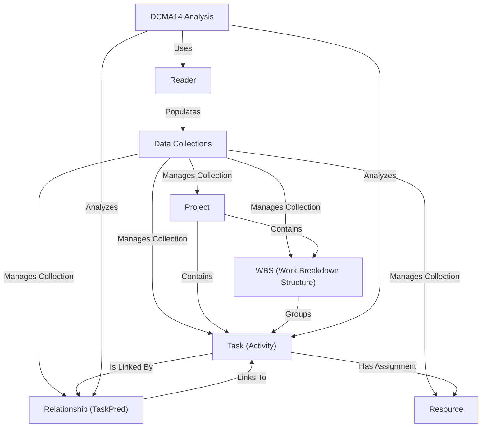

# Tutorial: PyP6Xer-dev

PyP6Xer-dev is a **Python library** designed to *read and understand* Primavera P6 XER files.
It transforms the complex XER data into **easy-to-use Python objects** representing project elements like tasks, resources, and their relationships.
This allows users to *analyze schedules*, perform checks like the **DCMA 14-point assessment**, or *extract specific information* programmatically.

## Visual Overview

## Chapters

1. [Reader](01_reader_.md)
2. [Data Collections](02_data_collections_.md)
3. [Project](03_project_.md)
4. [Task (Activity)](04_task__activity__.md)
5. [WBS (Work Breakdown Structure)](05_wbs__work_breakdown_structure__.md)
6. [Relationship (TaskPred)](06_relationship__taskpred__.md)
7. [Resource](07_resource_.md)
8. [DCMA14 Analysis](08_dcma14_analysis_.md)

---

Generated by [AI Codebase Knowledge Builder](https://github.com/The-Pocket/Tutorial-Codebase-Knowledge).
